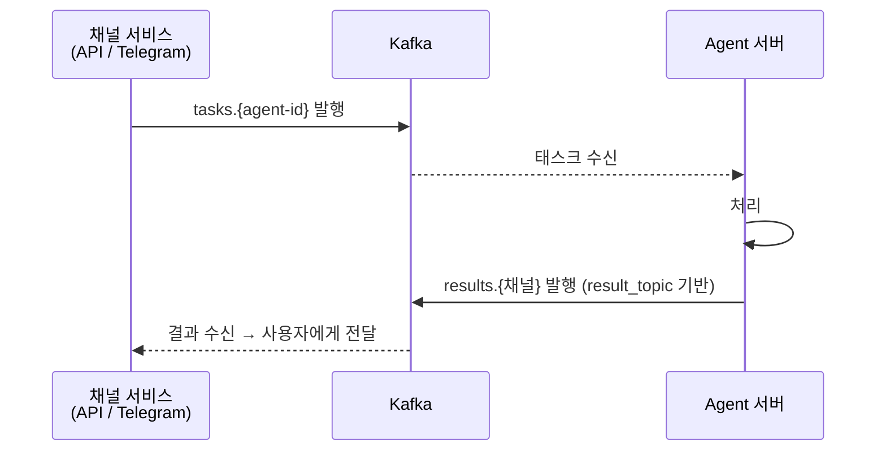
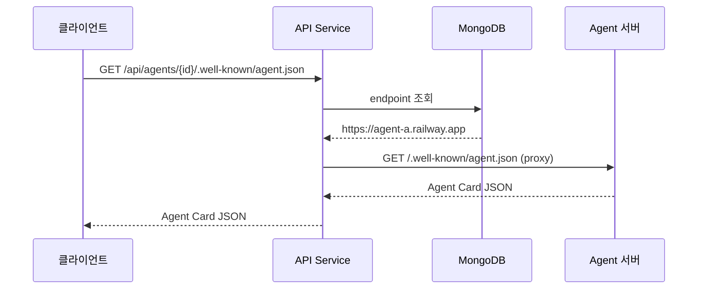
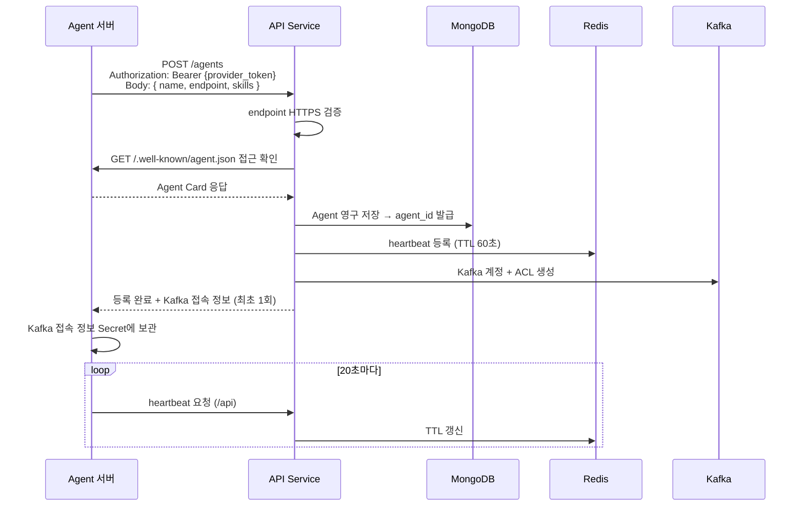

# 에이전트 레지스트리

## API Service 역할

API Service는 에이전트의 등록, 조회, 발견을 담당하는 중앙 서비스이다.

### 핵심 기능

- Agent 등록 → MongoDB에 영구 저장 + agent_id 발급
- 활성 Agent 목록 조회 (MongoDB 정보 + Redis heartbeat 조합)
- Agent Card proxy (외부에 안정적인 URL 제공)
- Agent 등록 시 Kafka 계정 + ACL 자동 생성
- Agent 등록 시 HTTPS endpoint 및 Agent Card 접근 검증

### 엔드포인트

| 엔드포인트 | 용도 |
|------------|------|
| `GET /agents` | 활성 Agent 전체 목록 |
| `GET /agents/{id}` | 특정 Agent 정보 |
| `GET /agents/{id}/.well-known/agent.json` | Agent Card proxy |
| `POST /agents` | Agent 등록 (Provider 인증 필요) |
| `PUT /agents/{id}/heartbeat` | Heartbeat TTL 갱신 |
| `DELETE /agents/{id}` | Agent 삭제 (Provider 인증 필요) |
| `POST /agents/{id}/credentials/rotate` | Kafka 계정 재발급 |

## 태스크 처리

API Service와 Telegram Service는 공용 SDK를 사용하여 Kafka를 통해 Agent와 직접 통신한다. 채널 서비스가 `tasks.{agent-id}` 토픽에 발행하고, 각 채널 전용 고정 토픽(`results.api`, `results.telegram`)을 상시 구독한다.

### 통신 흐름



### API Service 태스크 엔드포인트

| 엔드포인트 | 용도 |
|------------|------|
| `POST /agents/{id}/tasks` | 태스크 생성 → Kafka 발행, task_id 반환 (비동기) |
| `POST /agents/{id}/tasks:stream` | 태스크 생성 + 응답 자체가 SSE 스트림 |
| `GET /agents/{id}/tasks/{task_id}` | 태스크 상태/결과 조회 (history 포함 가능) |
| `POST /agents/{id}/tasks/{task_id}:cancel` | 태스크 취소 |
| `GET /agents/{id}/tasks/{task_id}:subscribe` | 끊어진 SSE 스트림 재연결 (backfill 지원) |

## MongoDB Agent 모델 (영구)

| 필드 | 설명 |
|------|------|
| agent_id | 시스템 발급 ID (UUID, 식별자) |
| name | 표시용 이름 (변경 가능) |
| provider_id | 소속 Provider |
| endpoint | Agent 서버 URL (HTTPS) |
| skills | 스킬 목록 |
| created_at | 등록 시간 |

Agent 등록 시 MongoDB에 영구 저장되며, `agent_id`가 시스템 전체의 식별자가 된다. 토픽명(`tasks.{agent_id}`), ACL, 화이트리스트 모두 이 ID를 사용한다.

## Redis 설계 (Heartbeat 전용)

### 키 구조

```
Key:   heartbeat:{agent_id}
Value: 1  (존재 여부만 확인)
TTL:   60초
```

Redis는 Agent의 **활성 여부만** 관리한다. Agent 메타데이터는 MongoDB에 저장.

### 활성 Agent 조회

MongoDB에서 Agent 정보 조회 + Redis에서 `heartbeat:{agent_id}` 존재 여부 확인 = 활성 Agent 목록.

### Heartbeat

| 항목 | 값 |
|------|-----|
| TTL | 60초 |
| 갱신 주기 | 20초 |
| 정상 종료 | 즉시 `DEL` |
| 비정상 종료 | TTL 만료 시 자동 제거 |

외부 Agent 서버는 Redis에 직접 접근할 수 없다 (VM1 내부 전용). Heartbeat는 API Service(`/api`)를 경유하여 처리된다. API Service가 요청을 받아 Redis에 대신 저장/갱신한다. 서버가 죽으면 60초 후 비활성으로 표시된다.

## Agent Card (A2A 스펙)

각 Agent 서버는 `/.well-known/agent.json` 경로로 자신을 설명하는 메타데이터를 노출한다.

### 포함 정보

| 필드 | 설명 |
|------|------|
| id | Agent 고유 식별자 |
| name | Agent 이름 |
| version | 버전 |
| endpoint | Agent 서버 URL |
| skills | 제공하는 스킬 목록 (id, name, description) |
| securitySchemes | 지원하는 인증 방식 |

### 외부 접근 URL

사용자/다른 Agent는 API Service를 통해 Agent Card에 접근한다.



Agent 서버 주소가 바뀌어도 외부 URL은 고정된다.

## Agent 등록 흐름



> Kafka 비밀번호는 최초 등록 응답에만 포함된다. 이후 재조회 불가. 재발급은 `POST /agents/{id}/credentials/rotate`로 명시적 요청 필요.

## 등록 시 검증

### 등록 시 검증 (POST /agents)

| 검증 항목 | 실패 시 |
|-----------|---------|
| Provider 토큰 유효 | 401 Unauthorized |
| Provider status가 ACTIVE | 403 Forbidden |
| endpoint가 `https://`로 시작 | 등록 거부 |
| `{endpoint}/.well-known/agent.json` 접근 가능 | 등록 거부 |

### Heartbeat 시 검증 (PUT /agents/{id}/heartbeat)

| 검증 항목 | 실패 시 |
|-----------|---------|
| Provider 토큰 유효 | 401 Unauthorized |
| agent_id가 MongoDB에 존재 | 404 Not Found (미등록 Agent 거절) |
| 요청 Provider가 해당 Agent의 소유자 | 403 Forbidden |

## A2A 엔드포인트 (Agent 서버가 노출)

A2A 프로토콜에 따라 각 Agent 서버는 다음 엔드포인트를 노출해야 한다.

| 엔드포인트 | 메서드 | 용도 |
|------------|--------|------|
| `/.well-known/agent.json` | GET | Agent Card (메타데이터) |
| `/tasks` | POST | 태스크 생성 (비동기, task_id 반환) |
| `/tasks:stream` | POST | 태스크 생성 + SSE 스트림 응답 (**필수**) |
| `/tasks/{task_id}` | GET | 태스크 상태/결과 조회 (history 포함 가능) |
| `/tasks/{task_id}:cancel` | POST | 태스크 취소 |
| `/tasks/{task_id}:subscribe` | GET | 끊어진 SSE 스트림 재연결 |

> `/tasks:stream` 엔드포인트는 A2A SSE 포맷을 반드시 준수해야 한다. 상세 포맷은 [04-messaging.md](04-messaging.md#a2a-sse-스트리밍-포맷) 참고.
