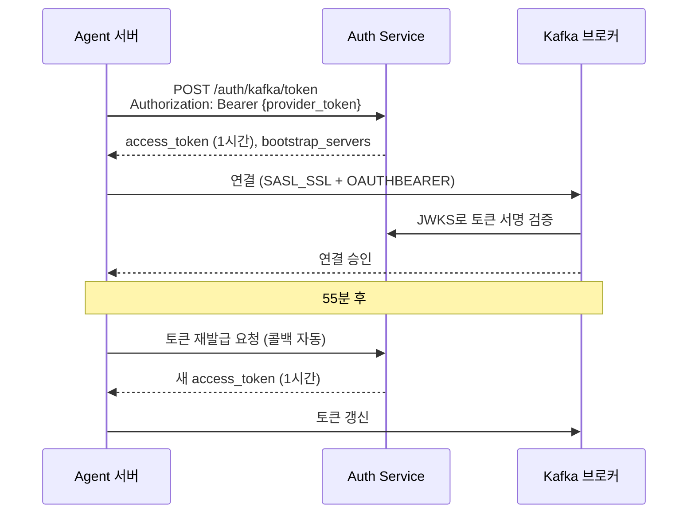
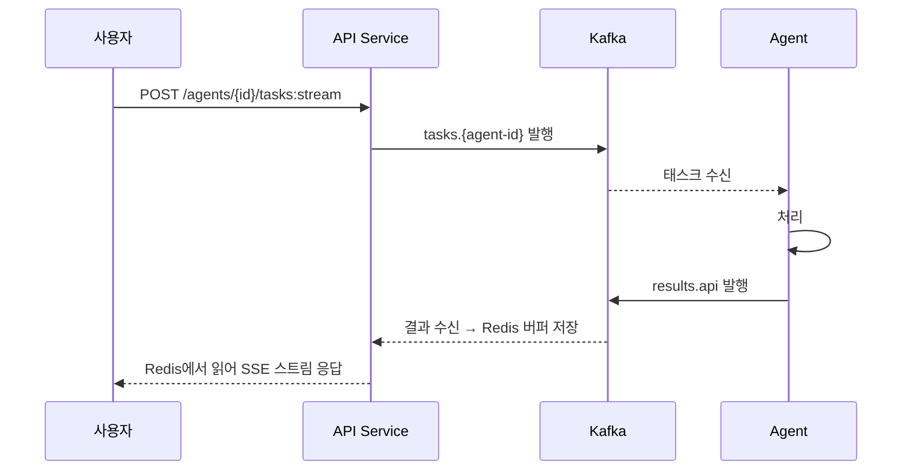
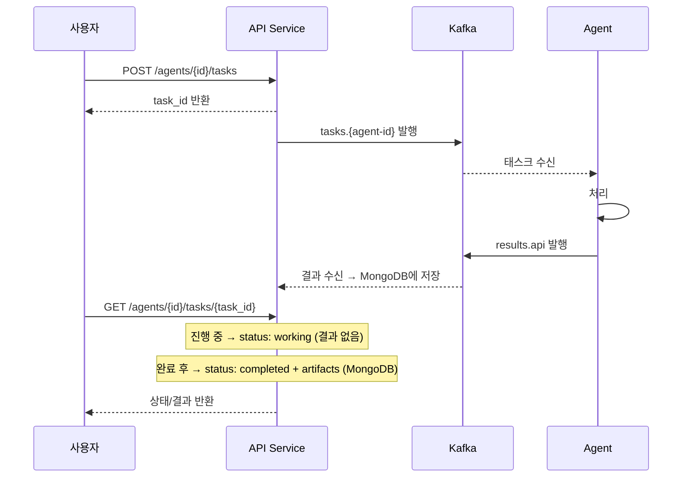
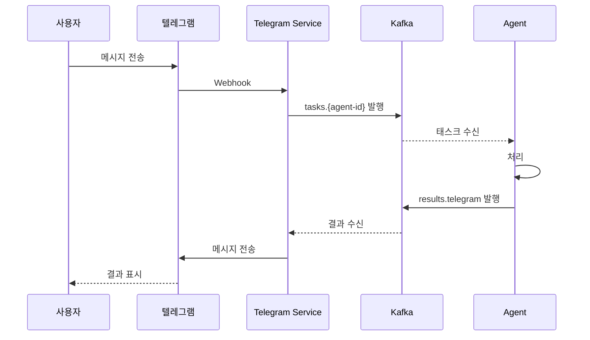
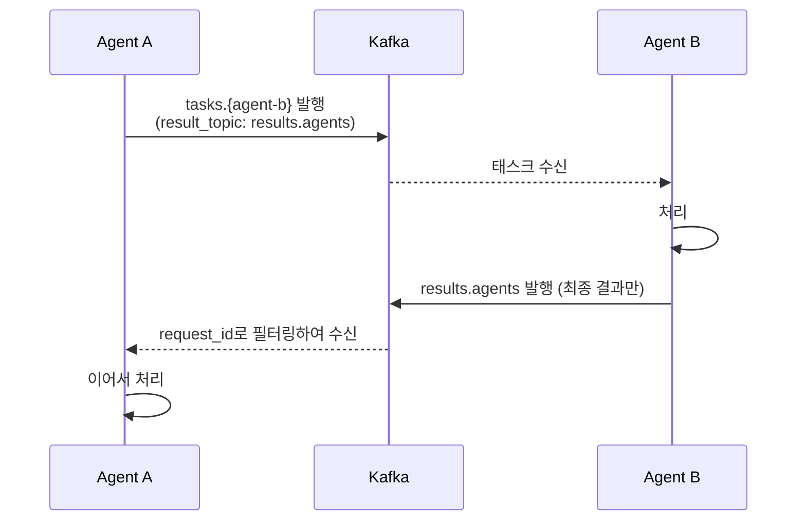
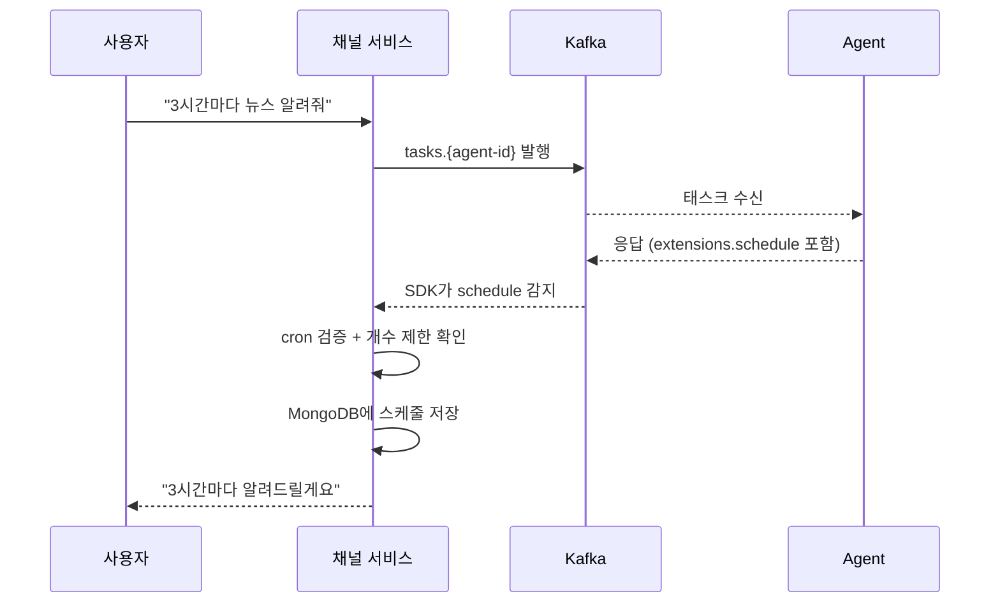
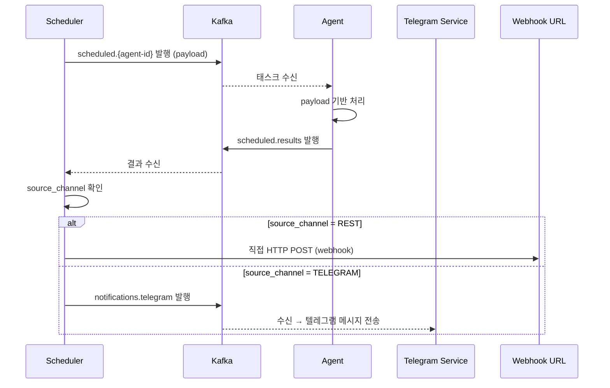

# 메시징 (Kafka)

## 개요

Agent 간 통신은 HTTP 직접 호출이 아닌 Kafka 메시지 기반 비동기 통신을 사용한다.

### 선택 이유

- Agent 서버의 HTTP/HTTPS 여부에 의존하지 않음
- Agent 장애 시 메시지가 큐에 보존되어 유실 방지
- Agent 서버 주소를 호출자가 알 필요 없음 (느슨한 결합)
- 같은 토픽을 여러 Agent가 구독하면 자연스러운 부하 분산

> 상세 결정 과정은 [ADR-002](decisions/adr-002-message-based-communication.md) 참고.

## Kafka 구성

| 항목 | 값 |
|------|-----|
| 모드 | KRaft (ZooKeeper 없음) |
| 내부 포트 | 9092 (VM1 내부, TLS) |
| 외부 포트 | 9093 (외부 Agent용, TLS + SASL) |
| 예상 메모리 | 1,024MB |

## 토픽 설계

### 일반 통신

| 토픽 패턴 | 용도 | 발행자 | 구독자 |
|-----------|------|--------|--------|
| `tasks.{agent-id}` | Agent에 태스크 발행 | API Service, Telegram Service, 다른 Agent | 해당 Agent |
| `results.api` | API Service용 결과 반환 | Agent (SDK) | API Service |
| `results.telegram` | Telegram Service용 결과 반환 | Agent (SDK) | Telegram Service |
| `results.agents` | Agent 간 호출 결과 반환 | Agent (SDK) | 호출한 Agent |

### 스케줄 통신

| 토픽 패턴 | 용도 | 발행자 | 구독자 |
|-----------|------|--------|--------|
| `scheduled.{agent-id}` | 스케줄 트리거 → Agent | Scheduler | 해당 Agent |
| `scheduled.results` | 스케줄 결과 → Scheduler | Agent (SDK) | Scheduler |
| `notifications.telegram` | 스케줄 결과 → 텔레그램 전달 | Scheduler | Telegram Service |

### 로그

| 토픽 패턴 | 용도 | 발행자 | 구독자 |
|-----------|------|--------|--------|
| `logs` | 로그 수집 | Fluent Bit | Loki |

### 메시지 구조

```json
{
  "task_id": "task-123",
  "context_id": "ctx-abc",
  "user_id": "user-456",
  "request_id": "req-789",
  "result_topic": "results.api",
  "allowed_agents": ["ag_xxxx", "ag_yyyy"],
  "message": {
    "role": "user",
    "content": "..."
  }
}
```

| 필드 | 설명 |
|------|------|
| task_id | 태스크 고유 ID (UUID v4) |
| context_id | A2A 멀티턴 대화 식별자 |
| user_id | 최초 요청 사용자 (체인 전체 유지) |
| request_id | Correlation ID (로그 추적용) |
| result_topic | 결과를 발행할 토픽 (`results.api`, `results.telegram`) |
| allowed_agents | 사용자가 허가한 Agent ID 목록 (화이트리스트) |
| message | A2A 메시지 본문 |

SDK는 `result_topic` 필드를 읽어 결과를 해당 토픽으로 자동 발행한다. 스케줄 태스크(`scheduled.*` 토픽에서 수신)는 `result_topic`과 무관하게 항상 `scheduled.results`로 발행한다.

## 인증: SASL OAUTHBEARER

Kafka 인증에 고정 비밀번호 대신 단기 토큰 방식을 사용한다.

### 흐름



### 토큰 검증

- Kafka 브로커가 Auth Service의 JWKS 엔드포인트(`/auth/.well-known/jwks.json`)에서 공개키를 가져와 토큰 서명 검증
- 매번 Auth Service에 요청하지 않고 공개키 캐싱으로 처리

### 탈취 시 피해 비교

| 방식 | 탈취 시 |
|------|---------|
| 고정 비밀번호 (SCRAM) | 수동 rotate 전까지 무한 사용 |
| OAUTHBEARER 토큰 | 최대 1시간, Provider 토큰 차단 시 갱신 불가 |

> 상세 결정 과정은 [ADR-004](decisions/adr-004-kafka-oauthbearer.md) 참고.

### 재발급 실패 시

- 기존 토큰으로 계속 시도
- 완전 만료되면 연결 끊김 → 재연결 시도 (exponential backoff)
- 일정 횟수 초과 시 알람

## ACL (접근 제어)

| 계정 | 토픽 | 권한 |
|------|------|------|
| api-service | `tasks.*` | Write |
| api-service | `results.api` | Read |
| telegram-service | `tasks.*` | Write |
| telegram-service | `results.telegram` | Read |
| telegram-service | `notifications.telegram` | Read |
| scheduler | `scheduled.{agent-id}` | Write |
| scheduler | `scheduled.results` | Read |
| scheduler | `notifications.telegram` | Write |
| agent-a | `tasks.agent-a` | Read |
| agent-a | `tasks.*` | Write (Agent 간 호출용) |
| agent-a | `results.api` | Write |
| agent-a | `results.telegram` | Write |
| agent-a | `results.agents` | Write, Read |
| agent-a | `scheduled.agent-a` | Read |
| agent-a | `scheduled.results` | Write |

- 채널 서비스: `tasks.*` 발행 + `results.*` 구독
- Scheduler: `scheduled.*` 발행 + `scheduled.results` 구독 + `notifications.telegram` 발행
- Agent: 일반/스케줄 토픽 구독 + 결과 발행 + 다른 Agent 호출 가능
- 다른 토픽에는 접근 불가

## 사용자 응답 방식

클라이언트는 두 가지 방식 중 선택할 수 있다.

### 스트리밍 (권장)

`POST /agents/{id}/tasks:stream` — 응답 자체가 SSE 스트림이므로 race condition 없이 즉시 이벤트 수신.

### 비동기 + 폴링

`POST /agents/{id}/tasks` — task_id만 반환. 이후 `GET /agents/{id}/tasks/{task_id}`로 상태/결과 폴링.

## 이전 메시지 조회

`GET /agents/{id}/tasks/{task_id}` 요청 시 `historyLength` 파라미터로 히스토리 포함 여부를 제어한다.

### historyLength 파라미터

| 값 | 동작 |
|----|------|
| 미설정 | 서버 기본값 (구현에 따라 다름) |
| `0` | 히스토리 미포함, `history` 필드 생략 |
| `> 0` | 최근 N개 메시지만 반환 |

### GetTask 응답 예시 (history 포함)

```json
{
  "jsonrpc": "2.0",
  "id": "req-001",
  "result": {
    "id": "task-123",
    "contextId": "ctx-abc",
    "status": { "state": "completed" },
    "artifacts": [],
    "history": [
      {
        "messageId": "msg-001",
        "role": "user",
        "parts": [{"type": "text", "text": "뉴스 요약해줘"}],
        "contextId": "ctx-abc"
      },
      {
        "messageId": "msg-002",
        "role": "agent",
        "parts": [{"type": "text", "text": "오늘 주요 뉴스..."}],
        "contextId": "ctx-abc"
      }
    ]
  }
}
```

### Message 객체 (A2A 표준)

| 필드 | 설명 | 필수 |
|------|------|------|
| messageId | 메시지 고유 ID | O |
| role | `user` 또는 `agent` | O |
| parts | 콘텐츠 배열 (TextPart, FilePart, DataPart) | O |
| contextId | 대화 그룹 식별자 | 선택 |
| taskId | 연관 태스크 ID | 선택 |
| referenceTaskIds | 참조 태스크 ID 목록 | 선택 |
| extensions | 확장 URI 목록 | 선택 |
| metadata | 메타데이터 (key-value) | 선택 |

같은 `context_id`를 사용하는 태스크들은 대화 히스토리를 공유한다.

## SSE 재연결

`GET /agents/{id}/tasks/{task_id}:subscribe` — 끊어진 SSE 스트림에 재연결. A2A 스펙에서는 backfill을 강제하지 않지만, 이 시스템에서는 **backfill을 지원한다**.

### Backfill 구현

SSE 스트림이 아직 연결되지 않았거나 끊어진 상태에서 도착한 이벤트는 Redis에 버퍼링한다.

```
Key:   stream:buffer:{task_id}
Value: List (이벤트 순서 보장)
TTL:   스트림 종료 시 즉시 삭제
```

스트림이 (재)연결되면 Redis 버퍼의 이벤트를 순서대로 replay한 후 실시간 스트림으로 전환한다.

### 버퍼 보안

- task_id는 UUID v4로 생성하여 추측 불가능하게 한다
- `:subscribe` 요청 시 해당 태스크의 소유 user_id와 요청자의 `X-User-Id`를 검증하여 불일치 시 `403 Forbidden` 반환

### 수평 확장과 Redis 버퍼

API Service가 수평 확장(replicas 2+)되면, Kafka consumer group 특성상 결과 메시지를 수신하는 인스턴스와 SSE 연결을 보유한 인스턴스가 다를 수 있다. Redis 버퍼가 인스턴스 간 메시지 브릿지 역할을 한다.

```
Kafka results.api
    ↓ consumer group — 아무 인스턴스가 수신
API Service 인스턴스 B
    ↓ Redis stream:buffer:{task_id}에 저장
API Service 인스턴스 A (SSE 연결 보유)
    ↓ Redis에서 읽어서 SSE로 전달
```

모든 결과는 항상 Redis 버퍼를 거치므로, 단일 인스턴스에서는 backfill 용도로, 수평 확장 시에는 인스턴스 간 라우팅 용도로 동작한다. Redis는 같은 VM 내부 Pod 간 통신이므로 추가 latency는 1~2ms 수준.

### 스트림 종료 후 처리

스트림이 종료(`final: true`)되면:

1. Redis 버퍼 즉시 clear
2. 태스크 결과(status, artifacts)를 MongoDB에 저장
3. 이후 `:subscribe` 요청 → `UnsupportedOperationError` 반환 (A2A 표준)
4. `GetTask` 요청 → MongoDB에서 조회하여 반환

## 태스크 수명 정책

### 보존 기간

| 구간 | 완료 후 경과 | 동작 |
|------|-------------|------|
| 활성 | 0 ~ 3일 | `GetTask` 정상 반환 |
| 만료 (soft delete) | 3 ~ 7일 | `GetTask` 시 `expired` 상태로 반환 |
| 삭제 (hard delete) | 7일 후 | MongoDB TTL Index가 자동 삭제, `TaskNotFoundError` 반환 |

### MongoDB 구현

태스크 완료 시 저장하는 필드:

| 필드 | 값 | 용도 |
|------|-----|------|
| `completed_at` | 완료 시각 | soft delete 판단 기준 (3일 초과 여부) |
| `expired_at` | 완료 시각 + 7일 | MongoDB TTL Index 대상 (hard delete) |

TTL Index: `expired_at` 필드에 `expireAfterSeconds: 0` 설정. MongoDB가 백그라운드에서 60초마다 만료 문서를 자동 삭제한다.

### GetTask 응답 변화

0 ~ 3일 (활성):
```json
{ "status": "completed", "artifacts": [...] }
```

3 ~ 7일 (soft delete):
```json
{ "status": "expired", "message": "태스크가 만료되었습니다" }
```

7일 후 (hard delete):
```json
{ "error": { "code": -32501, "message": "Task not found" } }
```

> 별도 워커 서비스 없이 MongoDB TTL Index + 조회 로직만으로 처리한다.

## 텔레그램 채널 스트리밍

텔레그램 Bot API는 SSE를 지원하지 않으므로 혼합 방식으로 처리한다.

### 동작 방식

| 구간 | 동작 |
|------|------|
| 태스크 시작 | "처리 중..." 메시지 전송 |
| 매 10초 | Redis 버퍼에 쌓인 이벤트를 합쳐서 `editMessageText`로 메시지 수정 |
| `final: true` | 최종 결과를 새 메시지로 전송 |

### 제약 사항

- 텔레그램 `editMessageText` rate limit: 분당 약 5회 (메시지당)
- 10초 간격은 rate limit 대비 안전 마진 확보 (제한 ~12초)
- 429 응답 시 `retry_after` 값을 존중하여 대기

## A2A SSE 스트리밍 포맷

Agent 서버는 반드시 A2A 프로토콜에 정의된 SSE 포맷으로 스트리밍해야 한다.

### HTTP 응답

- Status: `200 OK`
- Content-Type: `text/event-stream`
- 각 SSE `data` 필드에 JSON-RPC 2.0 응답 객체 포함

### 이벤트 타입

#### TaskStatusUpdateEvent — 상태 변화 알림

```json
event: message
data: {
  "jsonrpc": "2.0",
  "id": "client-req-1",
  "result": {
    "id": "task-123",
    "status": {
      "state": "working",
      "message": {
        "role": "agent",
        "parts": [{"type": "text", "text": "처리 중..."}]
      }
    },
    "final": false
  }
}
```

| 필드 | 설명 |
|------|------|
| id | 태스크 ID |
| status.state | 현재 상태 (`working`, `completed`, `failed`, `canceled`, `input-required`) |
| status.message | 진행 상황 또는 결과 메시지 |
| final | `false`: 진행 중, `true`: 스트림 종료 |

#### TaskArtifactUpdateEvent — 결과물 청크 전송

Agent가 생성한 콘텐츠를 점진적으로 전달한다.

| 필드 | 설명 |
|------|------|
| append | `false`: 새 콘텐츠 시작, `true`: 기존에 이어붙이기 |
| lastChunk | `true`: 마지막 청크 |

### 스트림 흐름 예시

```
data: { status: "working", final: false }        ← 진행 중
data: { artifact chunk 1, append: false }         ← 결과물 시작
data: { artifact chunk 2, append: true }          ← 이어붙이기
data: { artifact chunk 3, lastChunk: true }       ← 마지막 청크
data: { status: "completed", final: true }        ← 스트림 종료
```

### 스트림 종료 조건

`state`가 터미널 상태에 도달하면 `final: true`로 설정하고 스트림을 종료한다.

| 터미널 상태 | 설명 |
|-------------|------|
| `completed` | 정상 완료 |
| `failed` | 처리 실패 |
| `canceled` | 사용자 취소 |
| `rejected` | Agent가 거부 |
| `input-required` | 추가 입력 필요 (스트림은 종료되지만, 사용자가 입력 후 새 태스크로 대화 계속 가능) |

### Agent 서버 필수 준수 사항

- 모든 Agent 서버는 이 SSE 포맷을 준수해야 한다
- 공용 SDK가 이 포맷의 발행/파싱을 처리하므로 SDK 사용을 권장
- `final: true` 없이 연결을 끊으면 클라이언트는 비정상 종료로 간주

## 에러 응답 포맷

에러 응답은 JSON-RPC 2.0 형식을 따른다. HTTP 상태 코드는 항상 200을 반환하고, 에러는 body 안에서 처리한다.

### 응답 구조

```json
{
  "jsonrpc": "2.0",
  "id": "req-001",
  "error": {
    "code": -32062,
    "message": "Agent unavailable - Agent heartbeat expired"
  }
}
```

### 표준 JSON-RPC 에러

| 코드 | 이름 | 설명 |
|------|------|------|
| -32700 | ParseError | JSON 파싱 에러 |
| -32600 | InvalidRequest | 잘못된 요청 |
| -32601 | MethodNotFound | 메서드 없음 |
| -32602 | InvalidParams | 잘못된 파라미터 |
| -32603 | InternalError | 내부 에러 |

### A2A 표준 에러

| 코드 | 이름 | 설명 |
|------|------|------|
| -32501 | TaskNotFoundError | 태스크 ID가 존재하지 않음 |
| -32052 | ValidationError | 잘못된 요청 데이터 |
| -32053 | ThrottlingError | Rate limit 초과 |
| -32054 | ResourceConflictError | 리소스 충돌 |
| -32055 | TaskNotCancelableError | 이미 종료된 태스크 취소 시도 |
| -32056 | ContentTypeNotSupportedError | 미지원 미디어 타입 |
| -32057 | UnsupportedOperationError | 미지원 작업 |
| -32058 | VersionNotSupportedError | 미지원 A2A 프로토콜 버전 |

### 자체 정의 에러

`-32060 ~ -32069` 범위를 사용한다 (JSON-RPC 서버 정의 영역).

| 코드 | 이름 | 설명 |
|------|------|------|
| -32060 | CreditsExhaustedError | 크레딧 소진 |
| -32061 | AccountSuspendedError | User 또는 Provider 계정 정지 |
| -32062 | AgentUnavailableError | Agent 비활성 (heartbeat 끊김) |
| -32063 | AgentTimeoutError | Agent 응답 타임아웃 |
| -32064 | AgentStreamError | SSE 스트리밍 중 Agent 장애 |
| -32065 | ChannelNotLinkedError | 외부 채널(텔레그램 등) 미연동 |
| -32066 | ChannelAPIError | 외부 채널 API 장애 |

## 멀티턴 대화

A2A 프로토콜 표준 `context_id`를 활용한다.

### 흐름

1. 첫 번째 메시지: `context_id` 없이 전송
2. Agent 서버가 `context_id` 생성하여 응답에 포함
3. 이후 메시지: 동일한 `context_id`를 포함하여 전송
4. Agent는 `context_id`로 이전 대화 맥락을 유지

같은 `context_id`를 공유하는 모든 태스크는 전체 메시지 히스토리에 접근할 수 있다. 채널(WEB, TELEGRAM)에 무관하게 동일한 방식으로 동작한다.

## 전체 요청 흐름

### 사용자 → Agent (REST, 스트리밍)



### 사용자 → Agent (REST, 비동기)



### 사용자 → Agent (텔레그램)



### Agent → Agent

Agent 간 호출도 Kafka를 통해 직접 통신한다. 스트리밍 없이 최종 결과만 반환하며, 전용 토픽 `results.agents`를 사용한다.



> Agent 간 통신은 스트리밍이 아닌 단건 결과만 반환한다. Agent A는 `results.agents`를 상시 구독하고 `request_id`로 자기 요청을 식별한다.

## 스케줄 (플랫폼 확장)

스케줄 관련 상세 설계는 [08-scheduler.md](08-scheduler.md) 참고.

### 개요

Agent가 반복 작업이 필요하다고 판단하면, 응답의 `extensions.schedule`에 스케줄 지시를 포함한다. 공용 SDK가 이를 감지하여 플랫폼에 스케줄을 등록한다. Scheduler Service가 cron에 맞춰 Agent에 태스크를 발행하고, 결과를 원래 채널로 전달한다.

### extensions.schedule 구조

```json
{
  "status": "completed",
  "extensions": {
    "schedule": {
      "cron": "0 */3 * * *",
      "payload": {
        "action": "news_summary",
        "categories": ["tech", "finance"],
        "language": "ko"
      }
    }
  }
}
```

- `cron`: 실행 주기 (cron 표현식)
- `payload`: Agent가 자유롭게 정의하는 임의 JSON. 스케줄 트리거 시 그대로 Agent에 전달

### 스케줄 등록 제한

| 항목 | 제한 |
|------|------|
| 사용자당 최대 스케줄 수 | 30개 |
| cron 최소 간격 | 10분 (`*/10 * * * *` 이상) |
| cron 형식 | 표준 5필드만 허용 (초 단위 6필드 불가) |

등록 시 검증:
1. cron 표현식 파싱 검증 (유효하지 않으면 거부)
2. 실행 간격이 10분 미만이면 거부
3. 사용자의 현재 스케줄 수가 30개 이상이면 거부

### 스케줄 등록 흐름



> **권장**: Agent는 스케줄 등록 전 사용자에게 확인을 구하는 것을 권장한다 (예: "3시간마다 알려드릴까요?"). 스케줄이 등록되었다면 등록 사실과 cron 주기를 사용자에게 명확히 알려야 한다.

### 스케줄 실행 흐름



### 스케줄 메시지 구조

Scheduler → Agent (`scheduled.{agent-id}`):

```json
{
  "schedule_id": "sched-123",
  "request_id": "req-789",
  "user_id": "user-123",
  "context_id": "ctx-abc",
  "payload": {
    "action": "news_summary",
    "categories": ["tech", "finance"],
    "language": "ko"
  }
}
```

Agent → Scheduler (`scheduled.results`):

스케줄 태스크는 스트리밍이 아닌 단건 결과 텍스트를 반환한다.

```json
{
  "schedule_id": "sched-123",
  "request_id": "req-789",
  "result": {
    "role": "agent",
    "parts": [{"type": "text", "text": "오늘 주요 뉴스: ..."}]
  }
}
```

SDK는 수신 토픽에 따라 결과 발행 토픽을 자동 결정한다:
- `tasks.{agent-id}` → 메시지의 `result_topic` 필드로 발행 (`results.api` 또는 `results.telegram`)
- `scheduled.{agent-id}` → 항상 `scheduled.results`로 발행

Agent 코드 변경 불필요.

Scheduler → Telegram Service (`notifications.telegram`):

```json
{
  "schedule_id": "sched-123",
  "telegram_chat_id": 123456789,
  "message": {
    "role": "agent",
    "parts": [{"type": "text", "text": "오늘 주요 뉴스: ..."}]
  }
}
```

Telegram Service는 `telegram_chat_id`로 대상을 식별하고, `message.parts`에서 텍스트를 추출하여 텔레그램 API로 전송한다.

### MongoDB Schedule 모델

| 필드 | 설명 |
|------|------|
| id | 스케줄 ID |
| user_id | 사용자 식별자 |
| agent_id | 대상 Agent |
| cron | 실행 주기 (cron 표현식) |
| payload | Agent가 정의한 임의 데이터 (JSON) |
| context_id | 멀티턴 대화 연결용 |
| source_channel | `REST` / `TELEGRAM` |
| webhook_url | REST인 경우 알림 대상 URL |
| telegram_chat_id | 텔레그램인 경우 알림 대상 |
| created_at | 생성 시간 |

### Webhook 등록 (REST 사용자용)

userId 기반으로 webhook URL을 사전 등록한다.

| 엔드포인트 | 용도 |
|------------|------|
| `POST /api/webhooks` | webhook URL 등록 |
| `GET /api/webhooks` | 내 webhook 목록 |

#### Webhook URL 보안 (SSRF 방지)

Scheduler가 webhook URL로 직접 HTTP POST하므로, 등록 시 다음을 검증한다:

| 검증 항목 | 차단 대상 |
|-----------|-----------|
| HTTPS 강제 | `http://` 차단, `https://`만 허용 |
| Private IP 차단 | `127.0.0.0/8`, `10.0.0.0/8`, `172.16.0.0/12`, `192.168.0.0/16` |
| Localhost 차단 | `localhost`, `0.0.0.0` |
| 클라우드 메타데이터 차단 | `169.254.169.254`, `metadata.google.internal` 등 |
| DNS Rebinding 방지 | URL의 DNS resolve 결과가 private IP이면 차단 (등록 시 + 발행 시 모두 검증) |

| 엔드포인트 | 용도 |
|------------|------|
| `DELETE /api/webhooks/{id}` | webhook 삭제 |

### 스케줄 관리

| 엔드포인트 | 용도 |
|------------|------|
| `GET /api/schedules` | 내 스케줄 목록 |
| `GET /api/schedules/{id}/history` | 스케줄 실행 이력 (성공/실패) |
| `DELETE /api/schedules/{id}` | 스케줄 삭제 |

> 스케줄 **생성**은 Agent 응답의 `extensions.schedule`을 통해서만 가능. Agent만이 스케줄 필요 여부를 판단한다.

### 스케줄 등록 시 채널별 처리

| 채널 | 처리 |
|------|------|
| REST | SDK가 사용자의 등록된 webhook URL을 자동으로 `webhook_url`에 채움 |
| 텔레그램 | SDK가 현재 대화의 `chat_id`를 자동으로 `telegram_chat_id`에 채움 |

#### Edge case

- **REST에서 webhook 미등록 시**: 스케줄은 정상 등록되지만, Scheduler가 결과 전달 시 webhook이 없으면 **발행하지 않고 WARN 로그**를 남긴다. 사용자가 webhook을 등록하면 이후 스케줄부터 정상 전달.
- **텔레그램에서 chat_id 누락 시**: 발생할 수 없음 (Webhook 수신 시 항상 chat_id 포함)

> **권장**: Agent 개발자는 스케줄 삭제 API(`DELETE /api/schedules/{id}`)를 Agent의 툴로 제공하여, 사용자가 대화 중에 "스케줄 취소해줘"라고 요청하면 Agent가 직접 삭제할 수 있도록 구현하는 것을 권장한다.

### Scheduler Service

Kotlin + Spring Boot로 구현하며, K3s 상시 Pod으로 배포한다 (CronJob 아님 — `scheduled.results` 토픽을 상시 구독해야 하므로).

#### 실행 메커니즘

```
스케줄 등록 시:
  cron 표현식으로 next_run 계산 → MongoDB에 저장

Scheduler 폴링 루프 (매 30초, Spring @Scheduled):
  1. MongoDB 조회: next_run ≤ now AND (locked = false OR locked_at < now - 5분)
  2. findOneAndUpdate로 원자적 잠금 (locked: true, locked_at: now)
  3. payload를 Kafka scheduled.{agent-id}에 발행
  4. next_run 재계산 + locked 해제
```

#### MongoDB Schedule 추가 필드

| 필드 | 설명 |
|------|------|
| next_run | 다음 실행 시각 (cron에서 계산) |
| last_triggered_at | 마지막 실행 시각 |
| locked | 중복 실행 방지용 (boolean) |
| locked_at | 잠금 시각 (타임아웃 해제용) |

#### 역할

- MongoDB 폴링으로 실행할 스케줄 확인 (Spring `@Scheduled`)
- `scheduled.{agent-id}` 토픽에 태스크 발행 (Spring Kafka)
- `scheduled.results` 토픽 상시 구독
- 결과를 source_channel에 맞게 전달 (REST: webhook POST / 텔레그램: `notifications.telegram` 발행)
- Agent 타임아웃 처리 (일정 시간 무응답 시 실패 로그)
- 결과 전달 실패 시 재시도 (exponential backoff, 최대 3회: 1초 → 5초 → 30초)
- 3회 실패 시 MongoDB에 실패 기록 + WARN 로그
- 실행 이력은 `GET /api/schedules/{id}/history`로 조회 가능

> 수평 확장 시 MongoDB `findOneAndUpdate` 원자적 잠금으로 중복 실행을 방지한다.
