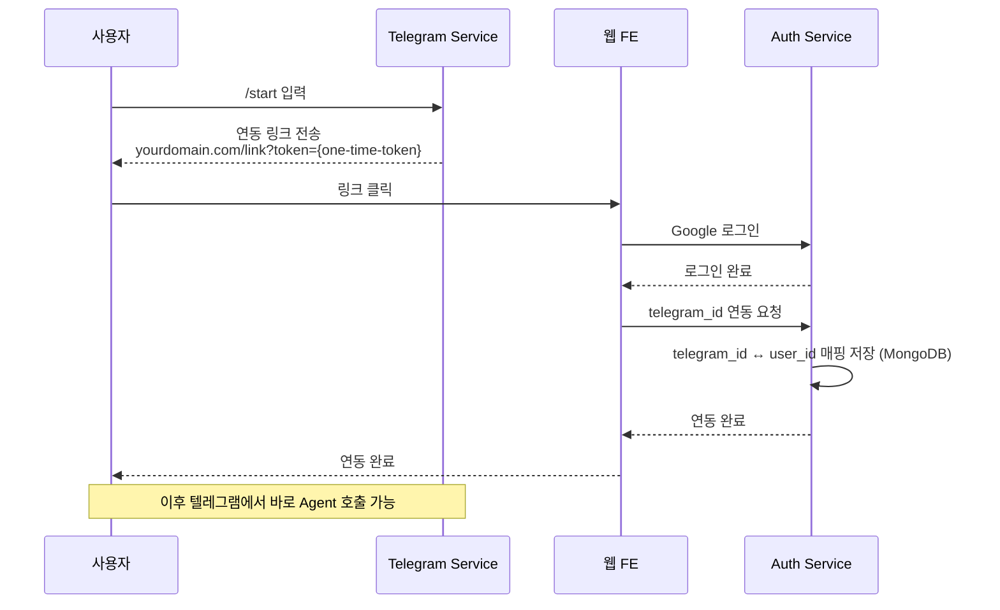
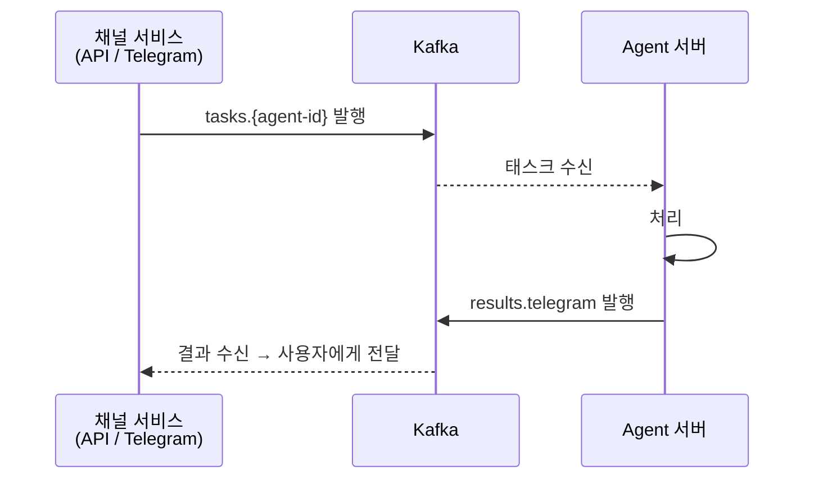

# 클라이언트 (FE / 텔레그램)

## 개요

사용자는 두 가지 채널로 Agent에 접근할 수 있다.

| 채널 | 형태 | 배포 위치 |
|------|------|-----------|
| 웹 FE | 대화 인터페이스 | VM1 내부 Pod |
| Telegram Service | Webhook 기반 봇 | VM1 내부 Pod |

두 채널 모두 Kafka를 통해 Agent에 태스크를 발행하고 결과를 수신한다. 내부 흐름은 동일하며 진입점만 다르다.

## 웹 FE

### 기능

- Google OAuth 로그인
- 텔레그램 연동 페이지
- Agent 목록 조회 (API Service → Agent Card 정보 표시)
- Agent 선택 후 대화 인터페이스
- 대화 히스토리 (A2A `context_id` 기반)

### 실시간 응답

`POST /agents/{id}/tasks:stream`을 사용하여 SSE로 실시간 응답을 수신한다. A2A 표준 SSE 포맷을 그대로 클라이언트에 전달.

| 방식 | 용도 |
|------|------|
| SSE (Server-Sent Events) | **기본 방식**. A2A 표준, `tasks:stream` 응답 |
| 폴링 | fallback. `GET /agents/{id}/tasks/{task_id}`로 상태 조회 |

### Agent 목록 UI

API Service에서 활성 Agent 목록을 조회하여 표시한다.

- Agent 이름, 설명
- 제공 스킬 목록
- 현재 상태 (활성/비활성)

## Telegram Service

### 동작 방식

- **Webhook 방식**: 텔레그램이 봇 서버로 메시지를 푸시
- VM1 내부 Pod으로 배포 → Kafka, MongoDB에 직접 접근 가능
- 별도 외부 인증 불필요 (내부 서비스)

### 텔레그램 커맨드

| 커맨드 | 용도 |
|--------|------|
| `/start` | 텔레그램 연동 시작 |
| `/agents` | 활성 Agent 목록 표시 |
| `/select {agent-id}` | Agent 선택 (이후 메시지는 이 Agent로 전달) |
| `/current` | 현재 선택된 Agent 확인 |
| `/new` | 대화 초기화 (새 context_id로 시작) |
| `/schedules` | 내 스케줄 목록 |
| `/cancel {schedule-id}` | 스케줄 삭제 |

선택된 Agent와 현재 `context_id`는 사용자별로 Redis에 세션으로 관리한다.

### 처리 흐름

1. 텔레그램에서 메시지 수신 (Webhook)
2. `telegram_id`로 내부 `user_id` 매핑 조회 (MongoDB)
3. 연동 안 된 사용자면 연동 안내
4. 연동된 사용자면 Kafka `tasks.{agent-id}` 토픽에 태스크 발행
5. Agent 결과를 `results.telegram` 토픽에서 수신
6. 결과를 텔레그램 메시지로 전송

### 응답 방식 (혼합)

텔레그램 Bot API는 SSE를 지원하지 않으므로 Redis 버퍼 + 주기적 메시지 수정으로 처리한다.

1. 태스크 시작 시 "처리 중..." 메시지 전송
2. 매 10초마다 Redis 버퍼에 쌓인 이벤트를 합쳐 `editMessageText`로 업데이트
3. `final: true` 수신 시 최종 결과를 새 메시지로 전송

> 상세 제약 사항은 [04-messaging.md](04-messaging.md#텔레그램-채널-스트리밍) 참고.

## 텔레그램 연동 흐름

### 연동 보안

- `link_token`은 Telegram Service가 생성, Auth Service가 MongoDB에 저장. 1회용, 만료 시간 설정
- 이미 연동된 telegram_id로 재연동 요청 시 기존 연동 해제 확인
- MongoDB User 문서에 `telegram_id`, `link_token`, `link_token_expiry` 필드 사용

## 공통 요청 흐름

채널에 무관하게 공용 SDK를 통해 Kafka로 직접 통신하므로 내부 흐름은 동일하다.

## 멀티턴 대화

A2A 프로토콜 표준 `context_id`를 사용하여 대화 연속성을 유지한다.

### 흐름

1. 첫 번째 메시지: `context_id` 없이 전송
2. Agent 서버가 `context_id` 생성하여 응답에 포함
3. 이후 메시지에 동일한 `context_id` 포함
4. Agent는 `context_id`로 이전 대화 맥락을 유지

### 채널 간 일관성

- 웹과 텔레그램 모두 동일한 `context_id` 메커니즘 사용
- `context_id`는 채널에 종속되지 않음
- 같은 `context_id`를 공유하는 모든 태스크는 전체 메시지 히스토리에 접근 가능

### Agent 서버 저장 구조

- **태스크 저장소**: A2A 형식의 메시지 히스토리 (`context_id`로 묶인 대화)
- **컨텍스트 저장소**: Agent 내부 상태 (툴 호출 기록, 추론 과정 등)
