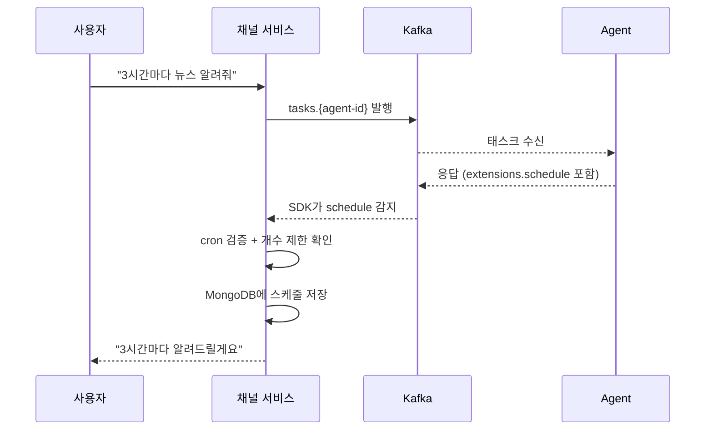
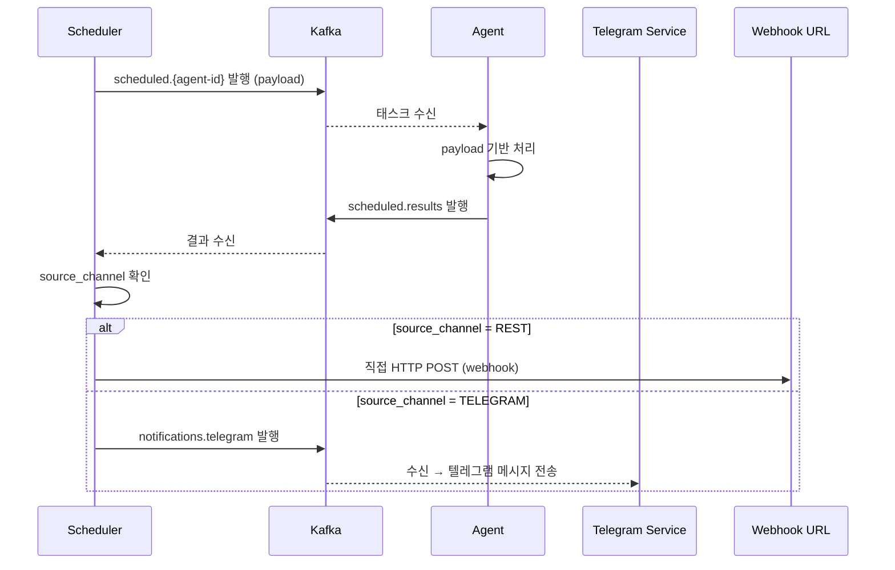

# 스케줄 (플랫폼 확장)

A2A 프로토콜에 스케줄링 기능은 없다. 플랫폼 자체 확장으로 A2A의 `extensions` 필드를 활용하여 구현한다.

## 개요

Agent가 반복 작업이 필요하다고 판단하면, 응답의 `extensions.schedule`에 스케줄 지시를 포함한다. 공용 SDK가 이를 감지하여 플랫폼에 스케줄을 등록한다. Scheduler Service가 cron에 맞춰 Agent에 태스크를 발행하고, 결과를 원래 채널로 전달한다.

## extensions.schedule 구조

```json
{
  "status": "completed",
  "extensions": {
    "schedule": {
      "cron": "0 */3 * * *",
      "payload": {
        "action": "news_summary",
        "categories": ["tech", "finance"],
        "language": "ko"
      }
    }
  }
}
```

- `cron`: 실행 주기 (cron 표현식)
- `payload`: Agent가 자유롭게 정의하는 임의 JSON. 스케줄 트리거 시 그대로 Agent에 전달

## 스케줄 등록 제한

| 항목 | 제한 |
|------|------|
| 사용자당 최대 스케줄 수 | 30개 |
| cron 최소 간격 | 10분 (`*/10 * * * *` 이상) |
| cron 형식 | 표준 5필드만 허용 (초 단위 6필드 불가) |

등록 시 검증:
1. cron 표현식 파싱 검증 (유효하지 않으면 거부)
2. 실행 간격이 10분 미만이면 거부
3. 사용자의 현재 스케줄 수가 30개 이상이면 거부

## 스케줄 등록 흐름



> **권장**: Agent는 스케줄 등록 전 사용자에게 확인을 구하는 것을 권장한다 (예: "3시간마다 알려드릴까요?"). 스케줄이 등록되었다면 등록 사실과 cron 주기를 사용자에게 명확히 알려야 한다.

## 스케줄 실행 흐름



## 스케줄 메시지 구조

### Scheduler → Agent (`scheduled.{agent-id}`)

```json
{
  "schedule_id": "sched-123",
  "request_id": "req-789",
  "user_id": "user-123",
  "context_id": "ctx-abc",
  "payload": {
    "action": "news_summary",
    "categories": ["tech", "finance"],
    "language": "ko"
  }
}
```

### Agent → Scheduler (`scheduled.results`)

스케줄 태스크는 스트리밍이 아닌 단건 결과 텍스트를 반환한다.

```json
{
  "schedule_id": "sched-123",
  "request_id": "req-789",
  "result": {
    "role": "agent",
    "parts": [{"type": "text", "text": "오늘 주요 뉴스: ..."}]
  }
}
```

SDK는 수신 토픽에 따라 결과 발행 토픽을 자동 결정한다:
- `tasks.{agent-id}` → 메시지의 `result_topic` 필드로 발행 (`results.api` 또는 `results.telegram`)
- `scheduled.{agent-id}` → 항상 `scheduled.results`로 발행

Agent 코드 변경 불필요.

### Scheduler → Telegram Service (`notifications.telegram`)

```json
{
  "schedule_id": "sched-123",
  "telegram_chat_id": 123456789,
  "message": {
    "role": "agent",
    "parts": [{"type": "text", "text": "오늘 주요 뉴스: ..."}]
  }
}
```

Telegram Service는 `telegram_chat_id`로 대상을 식별하고, `message.parts`에서 텍스트를 추출하여 텔레그램 API로 전송한다.

## MongoDB Schedule 모델

| 필드 | 설명 |
|------|------|
| id | 스케줄 ID |
| user_id | 사용자 식별자 |
| agent_id | 대상 Agent |
| cron | 실행 주기 (cron 표현식) |
| payload | Agent가 정의한 임의 데이터 (JSON) |
| context_id | 멀티턴 대화 연결용 |
| source_channel | `REST` / `TELEGRAM` |
| webhook_url | REST인 경우 알림 대상 URL |
| telegram_chat_id | 텔레그램인 경우 알림 대상 |
| next_run | 다음 실행 시각 (cron에서 계산) |
| last_triggered_at | 마지막 실행 시각 |
| locked | 중복 실행 방지용 (boolean) |
| locked_at | 잠금 시각 (타임아웃 해제용) |
| created_at | 생성 시간 |

## 채널별 처리

| 채널 | 처리 |
|------|------|
| REST | SDK가 사용자의 등록된 webhook URL을 자동으로 `webhook_url`에 채움 |
| 텔레그램 | SDK가 현재 대화의 `chat_id`를 자동으로 `telegram_chat_id`에 채움 |

### Edge case

- **REST에서 webhook 미등록 시**: 스케줄은 정상 등록되지만, Scheduler가 결과 전달 시 webhook이 없으면 **발행하지 않고 WARN 로그**를 남긴다. 사용자가 webhook을 등록하면 이후 스케줄부터 정상 전달.
- **텔레그램에서 chat_id 누락 시**: 발생할 수 없음 (Webhook 수신 시 항상 chat_id 포함)

## Webhook 등록 (REST 사용자용)

userId 기반으로 webhook URL을 사전 등록한다.

| 엔드포인트 | 용도 |
|------------|------|
| `POST /api/webhooks` | webhook URL 등록 |
| `GET /api/webhooks` | 내 webhook 목록 |
| `DELETE /api/webhooks/{id}` | webhook 삭제 |

### Webhook URL 보안 (SSRF 방지)

Scheduler가 webhook URL로 직접 HTTP POST하므로, 등록 시 다음을 검증한다:

| 검증 항목 | 차단 대상 |
|-----------|-----------|
| HTTPS 강제 | `http://` 차단, `https://`만 허용 |
| Private IP 차단 | `127.0.0.0/8`, `10.0.0.0/8`, `172.16.0.0/12`, `192.168.0.0/16` |
| Localhost 차단 | `localhost`, `0.0.0.0` |
| 클라우드 메타데이터 차단 | `169.254.169.254`, `metadata.google.internal` 등 |
| DNS Rebinding 방지 | URL의 DNS resolve 결과가 private IP이면 차단 (등록 시 + 발행 시 모두 검증) |

## 스케줄 관리

| 엔드포인트 | 용도 |
|------------|------|
| `GET /api/schedules` | 내 스케줄 목록 |
| `GET /api/schedules/{id}/history` | 스케줄 실행 이력 (성공/실패) |
| `DELETE /api/schedules/{id}` | 스케줄 삭제 |

> 스케줄 **생성**은 Agent 응답의 `extensions.schedule`을 통해서만 가능. Agent만이 스케줄 필요 여부를 판단한다.

> **권장**: Agent 개발자는 스케줄 삭제 API(`DELETE /api/schedules/{id}`)를 Agent의 툴로 제공하여, 사용자가 대화 중에 "스케줄 취소해줘"라고 요청하면 Agent가 직접 삭제할 수 있도록 구현하는 것을 권장한다.

## Scheduler Service

Kotlin + Spring Boot로 구현하며, K3s 상시 Pod으로 배포한다 (CronJob 아님 — `scheduled.results` 토픽을 상시 구독해야 하므로).

### 실행 메커니즘

```
스케줄 등록 시:
  cron 표현식으로 next_run 계산 → MongoDB에 저장

Scheduler 폴링 루프 (매 30초, Spring @Scheduled):
  1. MongoDB 조회: next_run ≤ now AND (locked = false OR locked_at < now - 5분)
  2. findOneAndUpdate로 원자적 잠금 (locked: true, locked_at: now)
  3. payload를 Kafka scheduled.{agent-id}에 발행
  4. next_run 재계산 + locked 해제
```

### 역할

- MongoDB 폴링으로 실행할 스케줄 확인 (Spring `@Scheduled`)
- `scheduled.{agent-id}` 토픽에 태스크 발행 (Spring Kafka)
- `scheduled.results` 토픽 상시 구독
- 결과를 source_channel에 맞게 전달 (REST: webhook POST / 텔레그램: `notifications.telegram` 발행)
- Agent 타임아웃 처리 (일정 시간 무응답 시 실패 로그)
- 결과 전달 실패 시 재시도 (exponential backoff, 최대 3회: 1초 → 5초 → 30초)
- 3회 실패 시 MongoDB에 실패 기록 + WARN 로그
- 실행 이력은 `GET /api/schedules/{id}/history`로 조회 가능

> 수평 확장 시 MongoDB `findOneAndUpdate` 원자적 잠금으로 중복 실행을 방지한다. `locked_at`이 5분 이상 경과한 잠금은 장애로 간주하고 자동 해제된다.
