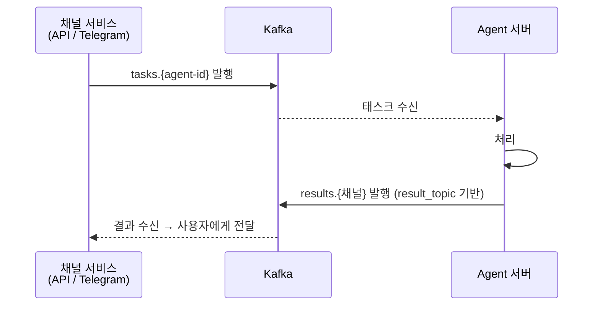
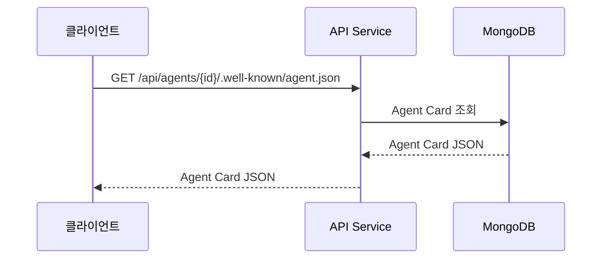
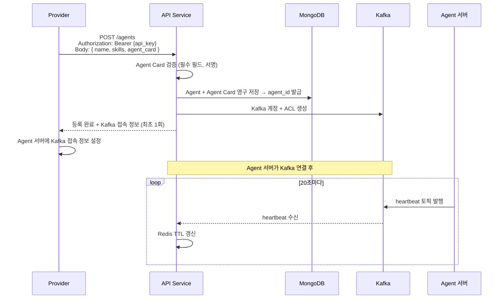

# 에이전트 레지스트리

## API Service 역할

API Service는 에이전트의 등록, 조회, 발견을 담당하는 중앙 서비스이며, 외부 사용자에게 A2A 프로토콜 호환 HTTP 인터페이스를 제공하는 **A2A 게이트웨이** 역할을 한다. Agent 서버는 HTTP를 노출하지 않으며, 모든 Agent 통신은 Kafka를 통해 이루어진다.

### 핵심 기능

- Agent 등록 → MongoDB에 영구 저장 + agent_id 발급
- 활성 Agent 목록 조회 (MongoDB 정보 + Redis heartbeat 조합)
- Agent Card 저장/제공 (등록 시 수신, MongoDB에서 조회)
- Agent 등록 시 Kafka 계정 + ACL 자동 생성
- A2A 호환 HTTP 엔드포인트 제공 (사용자 → API Service → Kafka → Agent)

### 엔드포인트

| 메서드 | 엔드포인트                                      | 용도                                        |
| ------ | ----------------------------------------------- | ------------------------------------------- |
| GET    | `/agents`                                       | 활성 Agent 전체 목록                        |
| GET    | `/agents/{id}`                                  | 특정 Agent 정보                             |
| GET    | `/agents/{id}/.well-known/agent.json`           | Agent Card 조회 (MongoDB)                   |
| POST   | `/agents`                                       | Agent 등록 (Provider 인증 필요)             |
| DELETE | `/agents/{id}`                                  | Agent 삭제 (Provider 인증 필요)             |
| POST   | `/agents/{id}/credentials/rotate`               | Kafka 계정 재발급                           |
| POST   | `/agents/{agentName}/registry`                  | Agent 생존 등록 (Provider API Key)          |
| POST   | `/agents/{agentName}/message:send`              | 메시지 전송 (User JWT → Kafka)              |

## 태스크 처리

API Service와 Telegram Service는 공용 SDK를 사용하여 Kafka를 통해 Agent와 직접 통신한다. 채널 서비스가 `tasks.{agent-id}` 토픽에 발행하고, 각 채널 전용 고정 토픽(`results.api`, `results.telegram`)을 상시 구독한다.

### 통신 흐름



> 토픽 설계, 메시지 구조, ACL 등 Kafka 통신 상세는 [메시징 문서](../shared/messaging.md) 참고.

### API Service 태스크 엔드포인트

| 엔드포인트                                   | 용도                                            |
| -------------------------------------------- | ----------------------------------------------- |
| `POST /agents/{id}/tasks`                    | 태스크 생성 → Kafka 발행, task_id 반환 (비동기) |
| `POST /agents/{id}/tasks:stream`             | 태스크 생성 + 응답 자체가 SSE 스트림            |
| `GET /agents/{id}/tasks/{task_id}`           | 태스크 상태/결과 조회 (history 포함 가능)       |
| `POST /agents/{id}/tasks/{task_id}:cancel`   | 태스크 취소                                     |
| `GET /agents/{id}/tasks/{task_id}:subscribe` | 끊어진 SSE 스트림 재연결 (backfill 지원)        |

## MongoDB Agent 모델 (영구)

| 필드        | 설명                             |
| ----------- | -------------------------------- |
| agent_id    | 시스템 발급 ID (UUID, 식별자)    |
| name        | 표시용 이름 (변경 가능)          |
| provider_id | 소속 Provider                    |
| agent_card  | Agent Card JSON (A2A 메타데이터) |
| skills      | 스킬 목록                        |
| created_at  | 등록 시간                        |

Agent 등록 시 MongoDB에 영구 저장되며, `agent_id`가 시스템 전체의 식별자가 된다. 토픽명(`tasks.{agent_id}`), ACL, 화이트리스트 모두 이 ID를 사용한다.

### Agent 이름 유일성

Agent name은 전체 플랫폼에서 유일하다. 다른 Provider라도 같은 이름의 Agent를 등록할 수 없다.
MongoDB 인덱스: `{name: 1}` (unique)

## Redis 설계 (Registry 전용)

### 키 구조

```
Key:   agent:registry:{agent_name}
Value: {agent_id}
TTL:   60초
```

Redis는 Agent의 **활성 여부만** 관리한다. Agent 메타데이터는 MongoDB에 저장.

### 활성 Agent 조회

1. Redis에서 `agent:registry:{agent_name}` 존재 확인
2. 존재 + TTL > 0 → ACTIVE
3. 미존재 또는 TTL 만료 → INACTIVE

### Heartbeat

| 항목        | 값                    |
| ----------- | --------------------- |
| TTL         | 60초                  |
| 갱신 주기   | 20초                  |
| 정상 종료   | 즉시 `DEL`            |
| 비정상 종료 | TTL 만료 시 자동 제거 |

Agent 서버는 Kafka `heartbeat` 토픽에 주기적으로 메시지를 발행한다. API Service의 HeartbeatConsumer가 이를 구독하여 Redis TTL을 갱신한다. Agent가 죽으면 Kafka 발행이 멈추고, 60초 후 TTL 만료로 비활성 처리된다.

> Heartbeat 토픽 상세는 [메시징 문서](../shared/messaging.md#토픽-설계) 참고.

### Agent Registry (생존 등록)

Agent가 기동 시 API Service에 생존을 알린다.

| 항목 | 값 |
|------|-----|
| 엔드포인트 | `POST /agents/{agentName}/registry` |
| 인증 | API Key (Provider 소유 확인) |
| 저장소 | Redis `agent:registry:{agentName}` = agentId, TTL 60초 |
| 멱등성 | 동일 요청 반복 시 TTL 갱신 |

흐름:
1. Provider가 `POST /agents`로 Agent를 MongoDB에 등록 (1회)
2. Agent 기동 시 `POST /agents/{agentName}/registry`로 Redis에 생존 등록
3. Heartbeat(Kafka `heartbeat` 토픽)가 20초마다 Redis TTL 갱신
4. Agent 종료 → heartbeat 멈춤 → 60초 후 TTL 만료 → 비활성

### A2A 메시지 전송

사용자가 Agent에 메시지를 보낸다.

| 항목 | 값 |
|------|-----|
| 엔드포인트 | `POST /agents/{agentName}/message:send` |
| 인증 | User JWT |
| 동작 | Redis에서 Agent 활성 확인 → Kafka `tasks.{agentId}` 발행 |
| 응답 | `{"taskId": "..."}` |
| Agent 비활성 시 | 503 AgentUnavailableError |

## Agent Card (A2A 스펙)

Agent Card는 등록 시 Provider가 제출하며, MongoDB에 저장된다. Agent 서버는 HTTP를 노출하지 않으므로 API Service가 Agent Card를 대신 제공한다.

### 포함 정보

| 필드        | 타입   | 설명          |
| ----------- | ------ | ------------- |
| name        | String | Agent 표시 이름 |
| description | String | Agent 설명    |
| version     | String | 버전          |

### 외부 접근 URL

사용자/다른 Agent는 API Service를 통해 Agent Card에 접근한다.



API Service가 A2A 표준 URL(`/.well-known/agent.json`)을 제공하므로, 외부에서는 표준 A2A 프로토콜과 동일하게 Agent Card에 접근할 수 있다.

## Agent 등록 흐름

Provider(사람/시스템)가 REST API로 Agent를 등록하고, Kafka 자격증명을 받아 Agent 서버에 설정한다. Agent 서버 자체는 HTTP를 노출하지 않는다.



> Kafka 비밀번호는 최초 등록 응답에만 포함된다. 이후 재조회 불가. 재발급은 `POST /agents/{id}/credentials/rotate`로 명시적 요청 필요.

## 등록 시 검증

### 등록 시 검증 (POST /agents)

| 검증 항목                 | 실패 시          |
| ------------------------- | ---------------- |
| API Key 유효              | 401 Unauthorized |
| Provider status가 ACTIVE  | 403 Forbidden    |
| Agent Card 필수 필드 포함 | 등록 거부        |
| Agent Card 서명 검증 통과 | 등록 거부        |
