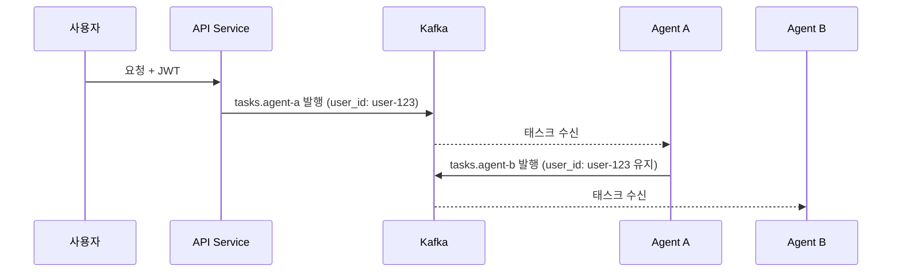

# 인증/인가

## 인증 주체

이 시스템에는 3가지 인증 주체가 존재한다.

| 주체                    | 인증 방식                         | 발급 토큰                  | 주입 헤더                  |
| ----------------------- | --------------------------------- | -------------------------- | -------------------------- |
| User (사람)             | Google OAuth → 자체 JWT           | User JWT (1시간)           | `X-User-Id`, `X-User-Role` |
| Provider (Agent 운영자) | Auth Service 가입 → Provider 토큰 | Provider Token (30~90일)   | `X-Provider-Id`            |
| Kafka 접근              | Provider 토큰 → 단기 토큰 교환    | Kafka Access Token (1시간) | — (SASL OAUTHBEARER)       |

## Auth Service

Auth Service는 모든 인증/인가를 중앙에서 담당한다.

### 역할

- Google OAuth 처리 및 자체 JWT 발급
- Provider 가입/토큰 발급/검증
- Kafka Access Token 발급 (`/auth/kafka/token`)
- Nginx `auth_request` 용 검증 엔드포인트 제공

### 엔드포인트

| 엔드포인트                        | 용도                                                                  |
| --------------------------------- | --------------------------------------------------------------------- |
| `POST /auth/google/login`         | Google OAuth 로그인 시작                                              |
| `GET /auth/google/callback`       | Google OAuth 콜백 → JWT 발급                                          |
| `POST /auth/provider/register`    | Provider 가입                                                         |
| `POST /auth/provider/token`       | Provider 토큰 발급                                                    |
| `POST /auth/kafka/token`          | Kafka Access Token 발급 (OAUTHBEARER)                                 |
| `GET /validate`                   | Nginx `auth_request` — 토큰 타입 자동 판별 (User JWT / Provider 토큰) |
| `GET /auth/.well-known/jwks.json` | JWKS 공개키 (Kafka 브로커 토큰 검증용)                                |

## User 인증 흐름

1. 사용자가 FE에서 Google 로그인
2. Google이 authorization code 반환
3. Auth Service가 Google에서 사용자 정보 조회
4. MongoDB에 사용자 저장 (없으면 생성)
5. 자체 JWT 발급하여 클라이언트에 반환
6. 이후 모든 요청은 자체 JWT만 사용

> Google 토큰은 Auth Service 내부에서만 사용되며, 외부에는 자체 JWT만 노출된다.

## Provider 인증 흐름

1. Provider가 Auth Service에 가입 요청 (`POST /auth/provider/register`)
2. Auth Service가 Provider 정보를 MongoDB에 `status: PENDING`으로 저장
3. Admin이 DB에서 직접 `status: ACTIVE`로 변경
4. ACTIVE 상태의 Provider만 토큰 발급 가능 (`POST /auth/provider/token`)
5. Provider 토큰 발급 (장기, 30~90일)
6. Agent 서버는 이 토큰을 환경변수/Secret에 보관
7. API Service, Kafka 토큰 요청 시 이 토큰 사용

## Kafka Access Token 흐름

1. Agent 서버가 Provider 토큰으로 `/auth/kafka/token` 요청
2. Auth Service가 Provider 토큰 검증
3. 단기 Kafka Access Token 발급 (1시간, JWT 형식)
4. Kafka 클라이언트가 OAUTHBEARER 방식으로 브로커에 인증
5. 만료 전 Kafka 클라이언트 콜백이 자동으로 재발급 요청

> Kafka 브로커는 Auth Service의 JWKS 엔드포인트로 토큰 서명을 검증한다. 매번 Auth Service에 요청하지 않고 공개키 캐싱으로 처리. 상세 흐름은 [메시징 문서](../shared/messaging.md#인증-sasl-oauthbearer) 참고.

## Nginx 헤더 주입

### 통합 Gateway (`/api`)

Auth Service가 토큰 타입(User JWT / Provider 토큰)을 자동 판별하여 적절한 헤더를 반환한다.

| 단계 | 동작                                                                                   |
| ---- | -------------------------------------------------------------------------------------- |
| 1    | 클라이언트 헤더 초기화: `X-User-Id`, `X-User-Role`, `X-Provider-Id`, `X-Agent-Id` 제거 |
| 2    | Auth Service `/validate`로 토큰 검증 (타입 자동 판별)                                  |
| 3    | User JWT인 경우 → `X-User-Id`, `X-User-Role` 반환                                      |
| 3'   | Provider 토큰인 경우 → `X-Provider-Id`, `X-Agent-Id`, `X-User-Id`(위임) 반환           |
| 4    | `X-Request-Id` 항상 새로 생성 (클라이언트 값 무시)                                     |
| 5    | 업스트림으로 포워딩                                                                    |

다운스트림 서비스는 `X-User-Id` 유무로 사용자 요청을, `X-Provider-Id` 유무로 Provider/Agent 요청을 구분한다.

> 헤더 스푸핑 방지 등 보안 상세는 [보안 문서](../shared/security.md#헤더스푸핑-레이어) 참고.

## 에이전트 체인에서 유저 정보 전파

사용자 → Agent A → Agent B → Agent C 같은 체인에서 `user_id`는 끝까지 유지되어야 한다.

### 원칙

- Agent 간 통신은 Kafka를 통해 이루어지므로 별도 JWT 발급 불필요
- Kafka SASL 인증으로 발행자(Agent)가 이미 검증됨
- `user_id`는 Kafka 메시지에 포함하여 체인 전체에 전파
- Agent는 수신한 `user_id`를 변경할 수 없음 (SDK가 강제)
- SDK 미사용 시 `user_id` 무결성은 보장하지 않음 (플랫폼 제약)

### Agent 화이트리스트

사용자는 사용할 Agent를 화이트리스트 방식으로 등록한다.

| 엔드포인트                         | 용도                        |
| ---------------------------------- | --------------------------- |
| `POST /api/me/agents/{agent_id}`   | 화이트리스트에 Agent 추가   |
| `GET /api/me/agents`               | 내 화이트리스트 조회        |
| `DELETE /api/me/agents/{agent_id}` | 화이트리스트에서 Agent 제거 |

#### 검증

- **채널 서비스 (신뢰)**: 태스크 발행 전 `allowed_agents`에 대상 agent_id 포함 여부 확인. 미포함 시 요청 거부.
- **Agent 간 호출 (SDK)**: 최초 태스크 메시지에 `allowed_agents` 목록이 포함됨. SDK가 Agent 간 호출 시 대상이 목록에 있는지 확인. 미포함 시 발행 거부.

### 흐름

## MongoDB 데이터 모델

### User

| 필드              | 설명                                     |
| ----------------- | ---------------------------------------- |
| id                | 내부 식별자                              |
| google_id         | Google 계정 ID                           |
| email             | 이메일                                   |
| name              | 이름                                     |
| role              | 권한 (USER, ADMIN)                       |
| allowed_agents    | 사용 허가한 Agent ID 목록 (화이트리스트) |
| telegram_id       | 텔레그램 연동 ID (nullable)              |
| link_token        | 텔레그램 연동용 1회 토큰 (nullable)      |
| link_token_expiry | 연동 토큰 만료 시간 (nullable)           |
| created_at        | 가입 시간                                |

### Provider

| 필드       | 설명                              |
| ---------- | --------------------------------- |
| id         | Provider 식별자                   |
| name       | Provider 이름                     |
| status     | 상태 (PENDING, ACTIVE, SUSPENDED) |
| token_hash | 토큰 해시값 (평문 저장 안 함)     |
| created_at | 가입 시간                         |
