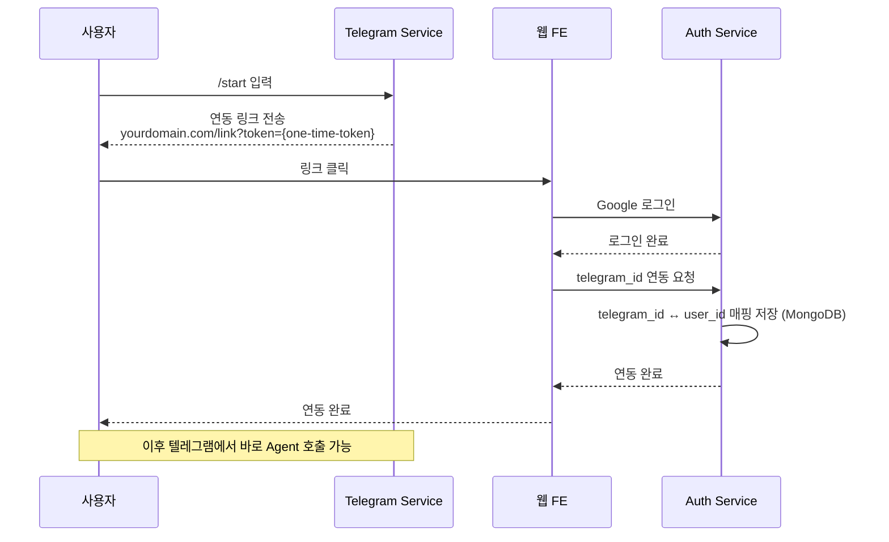
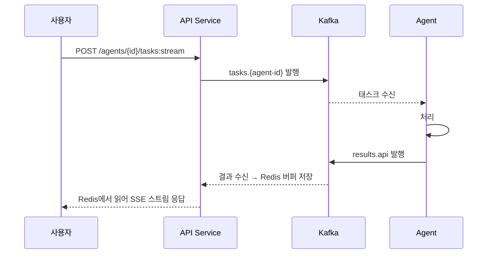

# 웹 FE

## 개요

웹 FE는 사용자가 Agent와 대화할 수 있는 웹 기반 인터페이스이다. VM1 내부 Pod으로 배포되며, API Service의 REST 엔드포인트를 통해 Agent와 통신한다.

| 항목      | 값                      |
| --------- | ----------------------- |
| 배포 위치 | VM1 내부 Pod            |
| 접근 경로 | `yourdomain.com/`       |
| 인증      | Google OAuth → User JWT |

## 기능

- Google OAuth 로그인
- 텔레그램 연동 페이지
- Agent 목록 조회 (API Service → Agent Card 정보 표시)
- Agent 선택 후 대화 인터페이스
- 대화 히스토리 (A2A `context_id` 기반)

## 실시간 응답

`POST /agents/{id}/tasks:stream`을 사용하여 SSE로 실시간 응답을 수신한다. A2A 표준 SSE 포맷을 그대로 클라이언트에 전달.

| 방식                     | 용도                                                     |
| ------------------------ | -------------------------------------------------------- |
| SSE (Server-Sent Events) | **기본 방식**. A2A 표준, `tasks:stream` 응답             |
| 폴링                     | fallback. `GET /agents/{id}/tasks/{task_id}`로 상태 조회 |

> SSE 포맷 상세 및 backfill 메커니즘은 [메시징 문서](../shared/messaging.md#sse-재연결) 참고.

## Agent 목록 UI

API Service에서 활성 Agent 목록을 조회하여 표시한다.

- Agent 이름, 설명
- 제공 스킬 목록
- 현재 상태 (활성/비활성)

## 멀티턴 대화

A2A 프로토콜 표준 `context_id`를 사용하여 대화 연속성을 유지한다.

1. 첫 번째 메시지: `context_id` 없이 전송
2. Agent 서버가 `context_id` 생성하여 응답에 포함
3. 이후 메시지에 동일한 `context_id` 포함
4. Agent는 `context_id`로 이전 대화 맥락을 유지

> 멀티턴 대화 메커니즘 상세 및 Agent 서버 저장 구조는 [메시징 문서](../shared/messaging.md#멀티턴-대화) 참고.

## 텔레그램 연동

웹 FE는 텔레그램 연동의 인증 측 역할을 담당한다. 사용자가 텔레그램에서 `/start`를 입력하면 연동 링크를 받고, 해당 링크를 통해 웹에서 Google 로그인 후 연동이 완료된다.

### 연동 보안

- `link_token`은 Telegram Service가 생성, Auth Service가 MongoDB에 저장. 1회용, 만료 시간 설정
- 이미 연동된 telegram_id로 재연동 요청 시 기존 연동 해제 확인
- MongoDB User 문서에 `telegram_id`, `link_token`, `link_token_expiry` 필드 사용

> 인증 관련 User 데이터 모델 상세는 [인증 문서](../auth/authentication.md#mongodb-데이터-모델) 참고.

## 요청 흐름

