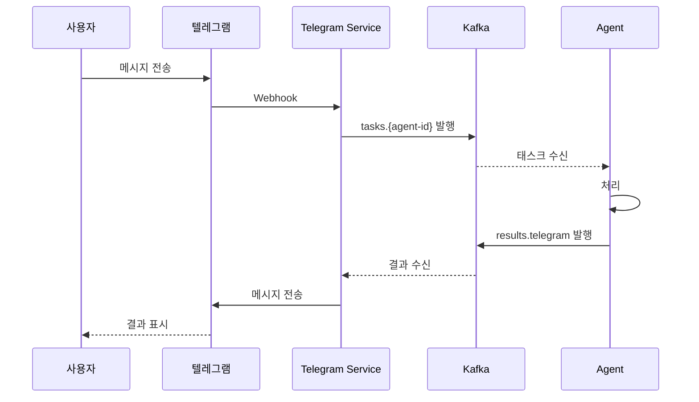

# Telegram Service

## 개요

Telegram Service는 텔레그램 봇을 통해 사용자가 Agent와 대화할 수 있는 채널 서비스이다. VM1 내부 Pod으로 배포되며, 공용 SDK를 사용하여 Kafka를 통해 Agent와 직접 통신한다.

| 항목      | 값                                         |
| --------- | ------------------------------------------ |
| 배포 위치 | VM1 내부 Pod                               |
| 동작 방식 | Webhook (텔레그램이 봇 서버로 메시지 푸시) |
| 인증      | 내부 서비스 (별도 외부 인증 불필요)        |

## 텔레그램 커맨드

| 커맨드                  | 용도                                       |
| ----------------------- | ------------------------------------------ |
| `/start`                | 텔레그램 연동 시작                         |
| `/agents`               | 활성 Agent 목록 표시                       |
| `/select {agent-id}`    | Agent 선택 (이후 메시지는 이 Agent로 전달) |
| `/current`              | 현재 선택된 Agent 확인                     |
| `/new`                  | 대화 초기화 (새 context_id로 시작)         |
| `/schedules`            | 내 스케줄 목록                             |
| `/cancel {schedule-id}` | 스케줄 삭제                                |

선택된 Agent와 현재 `context_id`는 사용자별로 Redis에 세션으로 관리한다.

## 처리 흐름

1. 텔레그램에서 메시지 수신 (Webhook)
2. `telegram_id`로 내부 `user_id` 매핑 조회 (MongoDB)
3. 연동 안 된 사용자면 연동 안내
4. 연동된 사용자면 Kafka `tasks.{agent-id}` 토픽에 태스크 발행
5. Agent 결과를 `results.telegram` 토픽에서 수신
6. 결과를 텔레그램 메시지로 전송



## 응답 방식

텔레그램 Bot API는 SSE를 지원하지 않으므로 Redis 버퍼 + 주기적 메시지 수정으로 처리한다.

### 동작 방식

| 구간          | 동작                                                              |
| ------------- | ----------------------------------------------------------------- |
| 태스크 시작   | "처리 중..." 메시지 전송                                          |
| 매 10초       | Redis 버퍼에 쌓인 이벤트를 합쳐서 `editMessageText`로 메시지 수정 |
| `final: true` | 최종 결과를 새 메시지로 전송                                      |

### 제약 사항

- 텔레그램 `editMessageText` rate limit: 분당 약 5회 (메시지당)
- 10초 간격은 rate limit 대비 안전 마진 확보 (제한 ~12초)
- 429 응답 시 `retry_after` 값을 존중하여 대기

## 텔레그램 연동

텔레그램 계정을 웹 계정과 연동하여 동일한 Agent 접근 권한을 공유한다.

### 연동 흐름

1. 사용자가 텔레그램에서 `/start` 입력
2. Telegram Service가 1회용 `link_token` 생성, 연동 링크 전송
3. 사용자가 링크 클릭 → 웹 FE에서 Google 로그인
4. Auth Service가 `telegram_id ↔ user_id` 매핑을 MongoDB에 저장
5. 연동 완료 → 이후 텔레그램에서 바로 Agent 호출 가능

> 연동 흐름 시퀀스 다이어그램 및 보안 상세는 [FE 문서](fe.md#텔레그램-연동) 참고.

### 연동 보안

- `link_token`은 1회용, 만료 시간 설정
- 이미 연동된 telegram_id로 재연동 요청 시 기존 연동 해제 확인

## 멀티턴 대화

웹 FE와 동일한 A2A `context_id` 메커니즘을 사용한다.

- `/new` 커맨드로 새 대화 시작 (새 `context_id` 생성)
- 같은 `context_id`를 공유하는 모든 태스크는 전체 메시지 히스토리에 접근 가능
- `context_id`는 채널에 종속되지 않음

> 멀티턴 대화 메커니즘 상세는 [메시징 문서](../shared/messaging.md#멀티턴-대화) 참고.

## 스케줄 알림 수신

Scheduler Service가 스케줄 결과를 `notifications.telegram` 토픽에 발행하면, Telegram Service가 이를 구독하여 해당 `telegram_chat_id`로 메시지를 전송한다.

```json
{
  "schedule_id": "sched-123",
  "telegram_chat_id": 123456789,
  "message": {
    "role": "agent",
    "parts": [{ "type": "text", "text": "오늘 주요 뉴스: ..." }]
  }
}
```

> 스케줄 메시지 구조 및 실행 흐름 상세는 [스케줄러 문서](../scheduler/scheduler.md) 참고.
