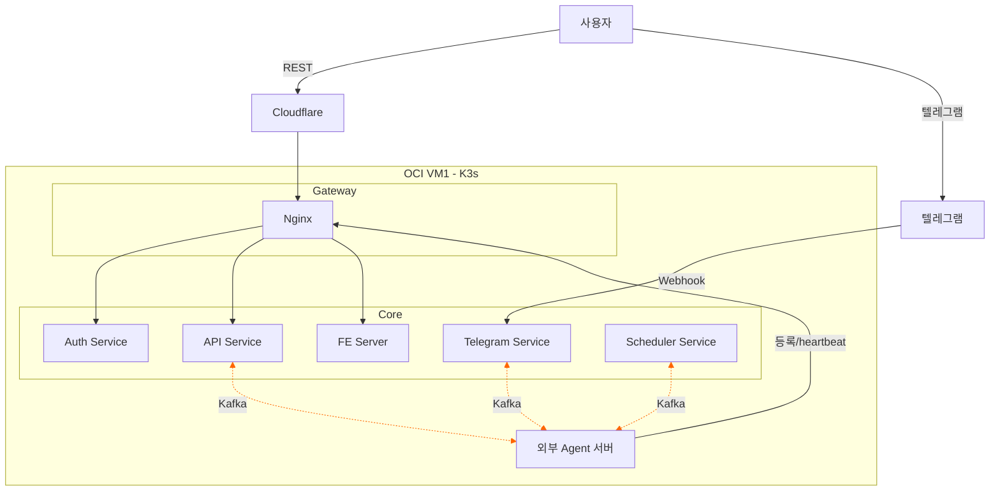

# 프로젝트 개요

## 목적

Google A2A(Agent2Agent) 프로토콜 기반의 멀티 에이전트 에코시스템을 구축한다. 다양한 환경에 배포된 AI Agent들이 표준화된 방식으로 서로 통신하고, 사용자는 웹 또는 텔레그램을 통해 Agent에 접근할 수 있는 플랫폼이다.

## 전체 아키텍처

> 점선(주황)은 Kafka를 경유하는 비동기 통신을 나타낸다.

## 구성 요소

### VM1 (OCI ARM64 — 4 OCPU / 24GB RAM)

| 구성 요소         | 역할                                                                           |
| ----------------- | ------------------------------------------------------------------------------ |
| Nginx             | 통합 Gateway, `auth_request` 기반 인증 위임 (토큰 타입 자동 판별)              |
| Auth Service      | Google OAuth 처리, JWT 발급, Provider 토큰 관리, Kafka 토큰 발급               |
| API Service       | Agent 등록/조회, Agent Card proxy, Kafka 계정 자동 생성, 태스크 발행/결과 수신 |
| MongoDB           | User, Provider 정보 저장                                                       |
| Redis             | Agent heartbeat, SSE 버퍼, 텔레그램 세션                                       |
| Kafka (KRaft)     | Agent 간 비동기 메시지 통신, 로그 버퍼                                         |
| FE Server         | 웹 대화 인터페이스, Google 로그인, 텔레그램 연동                               |
| Telegram Service  | Webhook 수신, 텔레그램 메시지 송수신                                           |
| Scheduler Service | 스케줄 실행, Agent에 발행, 결과를 채널별로 전달                                |
| **공용 SDK**      | **Kafka 통신 공용 SDK (Python, TypeScript, Java 지원)**                        |
| Fluent Bit        | Pod stdout 수집 → Kafka 전송                                                   |
| Loki              | 로그 저장/검색                                                                 |
| Grafana           | 대시보드, 알람                                                                 |

### 외부 Agent 서버

- AWS, GCP, Railway 등 어디에든 위치 가능
- Provider 토큰만 보유하면 연동 가능
- Docker 컨테이너로 실행, K3s 불필요
- HTTPS endpoint 필수 (Agent Card 제공 및 등록/heartbeat용, 태스크 통신은 Kafka)

### Cloudflare

- TLS 인증서 자동 발급/갱신
- DDoS 기본 방어
- Origin 인증서로 Full Strict 모드
- OCI VM 실제 IP 은닉

## 도메인 구조

| 경로                     | 인증                        | 대상                 |
| ------------------------ | --------------------------- | -------------------- |
| `yourdomain.com/`        | —                           | FE (대화 인터페이스) |
| `yourdomain.com/api`     | User JWT 또는 Provider 토큰 | API Service          |
| `yourdomain.com/grafana` | Cloudflare Access           | Grafana 대시보드     |

## 기술 스택

| 영역                    | 기술                                |
| ----------------------- | ----------------------------------- |
| Container Orchestration | K3s (단일 노드)                     |
| API / Auth              | Kotlin + Spring Boot                |
| Database                | MongoDB                             |
| Cache / Agent Registry  | Redis                               |
| Messaging               | Apache Kafka (KRaft 모드)           |
| Reverse Proxy           | Nginx                               |
| CDN / TLS               | Cloudflare (Free)                   |
| Logging                 | Fluent Bit → Kafka → Loki → Grafana |
| Infrastructure          | OCI Ampere A1 (ARM64, 무료 티어)    |
| SDK                     | 공용 SDK (Python, TypeScript, Java) |
| Protocol                | Google A2A                          |

## 문서 구조

### 서비스별 문서

| 문서                                             | 내용                                         |
| ------------------------------------------------ | -------------------------------------------- |
| [auth/authentication.md](auth/authentication.md) | Google OAuth, JWT, Provider 토큰, Kafka 토큰 |
| [api/agent-registry.md](api/agent-registry.md)   | Agent 등록/조회, Redis heartbeat, Agent Card |
| [scheduler/scheduler.md](scheduler/scheduler.md) | 스케줄 등록/실행, Webhook, Scheduler Service |

### 클라이언트 문서

| 문서                                       | 내용                                              |
| ------------------------------------------ | ------------------------------------------------- |
| [clients/fe.md](clients/fe.md)             | 웹 FE, Google 로그인, SSE 스트리밍, 텔레그램 연동 |
| [clients/telegram.md](clients/telegram.md) | Telegram Service, Webhook, 커맨드, 응답 방식      |

### 공통 문서

| 문서                                                 | 내용                                         |
| ---------------------------------------------------- | -------------------------------------------- |
| [shared/infrastructure.md](shared/infrastructure.md) | VM, K3s, Cloudflare, 도메인, Pod 구성        |
| [shared/messaging.md](shared/messaging.md)           | Kafka 기반 통신, 토픽 설계, OAUTHBEARER, SSE |
| [shared/security.md](shared/security.md)             | 위협 매트릭스, 대응, 헤더 보안, ACL          |
| [shared/logging.md](shared/logging.md)               | Fluent Bit, Loki, Grafana, X-Request-Id 추적 |

### ADR

| 문서                     | 내용                                              |
| ------------------------ | ------------------------------------------------- |
| [decisions/](decisions/) | Architecture Decision Records (ADR-001 ~ ADR-011) |

### ADR 목록

| ADR                                                     | 결정                                    |
| ------------------------------------------------------- | --------------------------------------- |
| [001](decisions/adr-001-a2a-protocol.md)                | 에이전트 간 통신 표준으로 A2A 채택      |
| [002](decisions/adr-002-message-based-communication.md) | HTTP 대신 Kafka 메시지 기반 비동기 통신 |
| [003](decisions/adr-003-provider-token-over-mtls.md)    | mTLS 대신 Provider 토큰 방식            |
| [004](decisions/adr-004-kafka-oauthbearer.md)           | Kafka 인증에 OAUTHBEARER 단기 토큰      |
| [005](decisions/adr-005-single-nginx-gateway.md)        | Nginx 1개로 통합, 경로 기반 분리        |
| [006](decisions/adr-006-redis-agent-registry.md)        | 인덱스 없이 Redis TTL + SCAN            |
| [007](decisions/adr-007-mongodb-over-rdbms.md)          | 관계형 DB 대신 MongoDB                  |
| [008](decisions/adr-008-cloudflare-full-strict.md)      | Cloudflare Full Strict 모드             |
| [009](decisions/adr-009-path-based-routing.md)          | 서브도메인 대신 경로 기반 라우팅        |
| [010](decisions/adr-010-oci-free-tier.md)               | OCI 무료 티어 VM + K3s                  |
| [011](decisions/adr-011-shared-sdk.md)                  | 별도 중계 서비스 대신 공용 SDK          |
