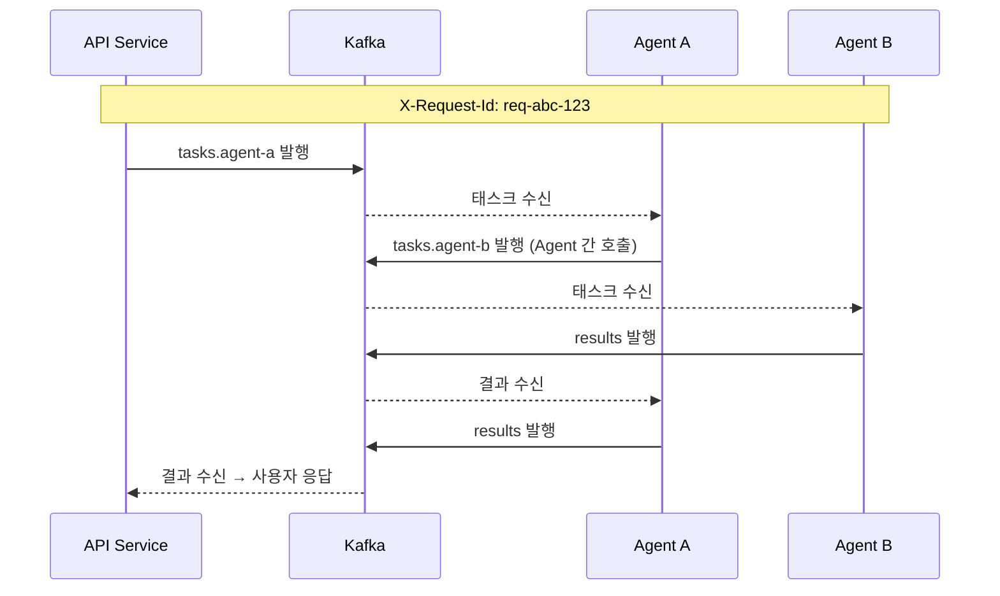
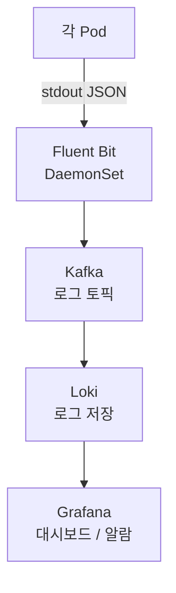

# 로깅/모니터링

## 로그 발생 지점

| 서비스           | 주요 로그                         |
| ---------------- | --------------------------------- |
| Nginx            | 접근 로그, 인증 실패              |
| Auth Service     | 로그인, 토큰 발급/검증 실패       |
| API Service      | Agent 등록/조회, 태스크 요청 수신 |
| FE Server        | 웹 인터페이스 접근, 연동 요청     |
| Telegram Service | Webhook 수신, 메시지 송수신       |
| Agent 서버       | 태스크 실행, Agent 간 호출        |
| Redis            | 연결 오류, 키 만료                |

## Correlation ID (X-Request-Id)

에이전트 체인에서 하나의 요청이 여러 서버에 흔적을 남기므로, 전체를 하나로 묶는 Correlation ID가 핵심이다.

### 규칙

- Nginx가 최초 요청 진입 시 `X-Request-Id`를 항상 새로 생성 (클라이언트가 보낸 값은 무시)
- 모든 업스트림 요청에 포함하여 전달
- Agent 간 호출 시에도 **동일한 값 유지** (절대 새로 생성하지 않음)
- 모든 로그에 `request_id` 필드 필수

### 추적 예시

## 로그 포맷

모든 서비스는 **JSON 형식**으로 stdout에 출력한다.

### 필드

| 필드         | 설명                                        | 필수        |
| ------------ | ------------------------------------------- | ----------- |
| timestamp    | ISO 8601 형식                               | O           |
| level        | INFO, WARN, ERROR 등                        | O           |
| service      | 서비스 이름 (auth, api-service, agent-a 등) | O           |
| request_id   | X-Request-Id                                | O           |
| user_id      | 요청 사용자                                 | 가능한 경우 |
| agent_id     | 관련 Agent                                  | 가능한 경우 |
| action       | 수행 동작 (task.execute, token.validate 등) | O           |
| target_agent | 호출 대상 Agent                             | 가능한 경우 |
| duration_ms  | 처리 소요 시간                              | 가능한 경우 |
| status       | success, failure                            | O           |

## 수집 파이프라인

### VM1 내부 서비스

- Fluent Bit은 K3s DaemonSet으로 각 Pod의 stdout을 자동 수집
- Kafka 로그 토픽을 버퍼로 사용하여 로그 유실 방지
- Loki가 Kafka 로그 토픽을 구독하여 저장

### 외부 Agent 서버

- 초기: 각자 환경의 로그 시스템 활용 (CloudWatch, Cloud Logging 등)
- 향후: API(`/api`) 경유로 Loki 중앙화 가능
- **로그 포맷(JSON + X-Request-Id)만 통일**해두면 나중에 통합 용이

## Grafana

### 접속

- 웹 브라우저: `yourdomain.com/grafana`
- 초기 계정: admin / 환경변수로 지정한 비밀번호
- Google OAuth 연동 로그인 가능

### 접근 제한

| 방법              | 설명                                     |
| ----------------- | ---------------------------------------- |
| Cloudflare Access | Google 계정 인증 후에만 접근 (무료 50명) |
| IP 화이트리스트   | Nginx에서 특정 IP만 허용                 |
| VPN               | 가장 안전, 운영 부담 있음                |

초기에는 Cloudflare Access 또는 IP 화이트리스트 추천.

### 대시보드

- 실시간 에러율
- Agent별 요청 수
- X-Request-Id로 체인 전체 추적
- Provider별 호출량
- Agent heartbeat 상태

## 알람

### 보안 알람

| 조건                                 | 대응      |
| ------------------------------------ | --------- |
| 동일 IP에서 인증 실패 5회 이상 / 1분 | 즉시 알림 |
| 존재하지 않는 Agent ID로 접근        | 즉시 알림 |
| X-Internal-Token 없이 직접 접근 시도 | 즉시 알림 |

### 운영 알람

| 조건                              | 대응 |
| --------------------------------- | ---- |
| Agent TTL 만료 (서버 다운)        | 알림 |
| Auth Service 응답 지연 > 500ms    | 경고 |
| Agent 체인 전체 duration > 임계값 | 경고 |

### 알림 채널

Slack, Email, Webhook 등 Grafana에서 지원하는 채널로 발송.

## 로그 보존 정책

| 분류                             | 보존 기간 |
| -------------------------------- | --------- |
| 보안 로그 (인증 실패, 접근 거부) | 1년       |
| 일반 접근 로그                   | 90일      |
| 디버그 로그                      | 7일       |
