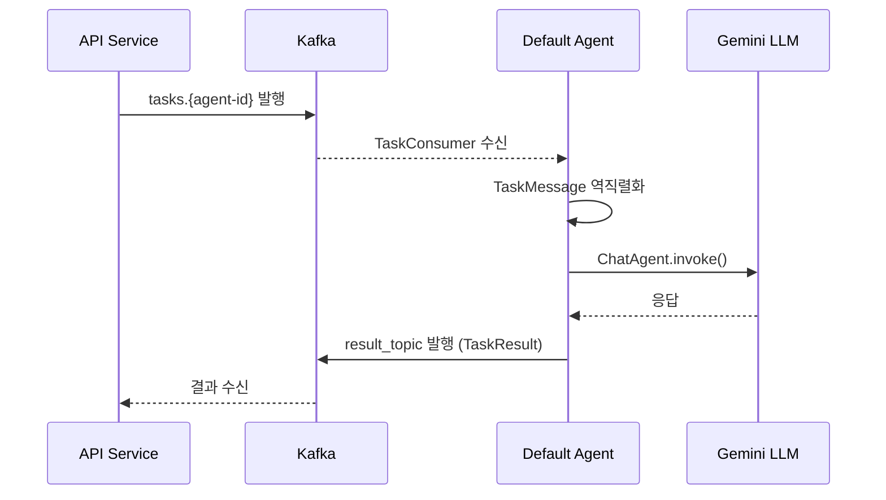
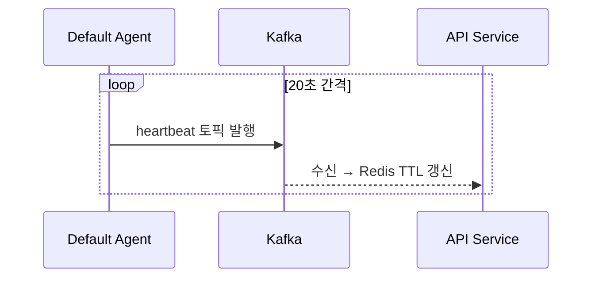
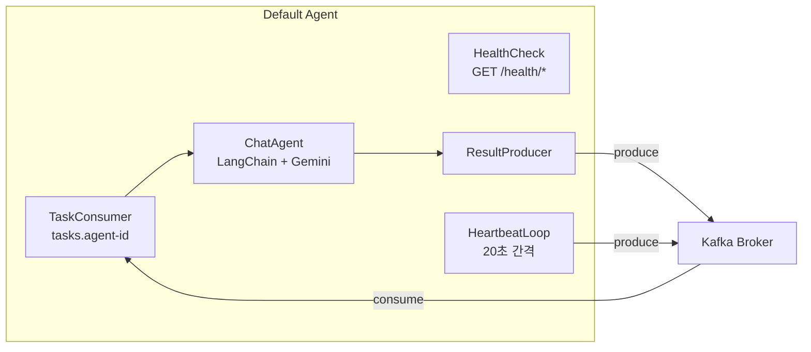

# Default Agent Kafka 전환 설계

## 개요

Default Agent의 통신 방식을 HTTP에서 Kafka로 전환한다. `tasks.{agent-id}` 토픽을 구독해 태스크를 수신하고, `result_topic`(메시지에 명시)에 결과를 발행한다. `heartbeat` 토픽에 20초 간격으로 생존 신호를 보낸다. HTTP는 헬스체크만 유지.

## 환경변수

```env
GOOGLE_API_KEY=...
AGENT_ID=agent-001                    # API Service에서 등록 후 받은 ID
KAFKA_BOOTSTRAP_SERVERS=localhost:9092 # dev: PLAINTEXT
PORT=8090                             # 헬스체크용
```

`AGENT_ID`는 Agent 개발자가 API Service를 통해 미리 등록한 뒤 받은 ID를 환경변수로 설정한다.

## 동작 흐름

### 태스크 처리



### Heartbeat



### 내부 컴포넌트 구조



## 제거 대상

- `POST /` (동기 태스크)
- `POST /stream` (SSE 스트리밍)
- `GET /.well-known/agent.json` (AgentCard)
- `app/routes/task.py` 삭제
- `app/routes/agent_card.py` 삭제
- `app/models/a2a.py` 삭제 (messages.py로 대체)
- `sse-starlette` 의존성 제거

## Kafka 메시지 포맷

A2A 공식 proto 정의(`a2aproject/A2A/specification/a2a.proto`)를 따른다.

### Part 구조 (A2A 공식)

Part는 `oneof` 구조로, `type` 필드 없이 콘텐츠 종류에 따라 필드가 달라진다:

```json
{"text": "안녕하세요"}
{"text": "응답입니다", "metadata": {"confidence": 0.95}}
```

텍스트 전용 Agent이므로 현재는 `text` 필드만 사용한다.

### Message 구조 (A2A 공식)

```json
{
  "message_id": "msg-001",
  "role": "user",
  "parts": [{"text": "안녕하세요"}],
  "context_id": "ctx-abc",
  "task_id": "task-123",
  "metadata": {},
  "extensions": [],
  "reference_task_ids": []
}
```

| 필드 | 설명 | 필수 |
|------|------|------|
| message_id | 메시지 고유 ID (UUID) | O |
| role | `user` 또는 `agent` | O |
| parts | Part 배열 | O |
| context_id | 대화 그룹 식별자 | 선택 |
| task_id | 연관 태스크 ID | 선택 |
| metadata | 메타데이터 (key-value) | 선택 |
| extensions | 확장 URI 목록 | 선택 |
| reference_task_ids | 참조 태스크 ID 목록 | 선택 |

### 수신 (`tasks.{agent-id}`)

```json
{
  "task_id": "task-123",
  "context_id": "ctx-abc",
  "user_id": "user-456",
  "request_id": "req-789",
  "result_topic": "results.api",
  "allowed_agents": ["agent-001", "agent-002"],
  "message": {
    "message_id": "msg-001",
    "role": "user",
    "parts": [{"text": "안녕하세요"}]
  }
}
```

| 필드 | 설명 |
|------|------|
| task_id | 태스크 고유 ID (UUID v4) |
| context_id | A2A 멀티턴 대화 식별자 |
| user_id | 최초 요청 사용자 (체인 전체 유지) |
| request_id | Correlation ID (로그 추적용) |
| result_topic | 결과를 발행할 토픽 |
| allowed_agents | 사용자가 허가한 Agent ID 목록 (화이트리스트) |
| message | A2A Message 객체 |

### 발행 (result_topic)

```json
{
  "task_id": "task-123",
  "context_id": "ctx-abc",
  "user_id": "user-456",
  "request_id": "req-789",
  "agent_id": "agent-001",
  "status": {
    "state": "completed",
    "message": {
      "message_id": "msg-002",
      "role": "agent",
      "parts": [{"text": "응답입니다"}]
    },
    "timestamp": "2026-04-08T17:00:00Z"
  },
  "final": true
}
```

### heartbeat (`heartbeat` 토픽)

```json
{
  "agent_id": "agent-001",
  "timestamp": "2026-04-08T17:00:00Z"
}
```

## 프로젝트 구조

```
agents/default/app/
├── main.py            # FastAPI (헬스체크만) + Kafka lifespan
├── config.py           # Settings에 AGENT_ID, KAFKA_BOOTSTRAP_SERVERS 추가
├── logging.py          # 변경 없음
├── models/
│   └── messages.py     # Kafka 메시지 Pydantic 모델 (A2A 공식 스펙 기반)
├── kafka/
│   ├── __init__.py
│   ├── consumer.py     # TaskConsumer: tasks.{agent-id} 구독, 메시지 처리
│   ├── producer.py     # ResultProducer: 결과/heartbeat 발행
│   └── heartbeat.py    # HeartbeatLoop: 20초 간격 asyncio.Task
├── agent/
│   └── chat.py         # 변경 없음
└── routes/
    └── health.py       # 변경 없음
```

## 핵심 컴포넌트

### Settings (`app/config.py`)

```python
class Settings(BaseSettings):
    google_api_key: str = ""
    agent_id: str = "default-agent"
    kafka_bootstrap_servers: str = "localhost:9092"
    port: int = 8090
```

### Pydantic 모델 (`app/models/messages.py`)

A2A 공식 proto 기반 Pydantic 모델:

- `Part` — text 필드 (현재 텍스트만 지원), metadata, media_type (선택)
- `Message` — message_id (필수), role (필수), parts (필수), context_id, task_id, metadata, extensions, reference_task_ids
- `TaskMessage` — 수신 메시지 (task_id, context_id, user_id, request_id, result_topic, allowed_agents, message)
- `TaskStatus` — state (필수), message, timestamp
- `TaskResult` — 발행 결과 (task_id, context_id, user_id, request_id, agent_id, status, final)
- `HeartbeatMessage` — agent_id, timestamp

### ResultProducer (`app/kafka/producer.py`)

- `aiokafka.AIOKafkaProducer` 래핑
- `send_result(topic, result: TaskResult)` — 결과 발행
- `send_heartbeat(msg: HeartbeatMessage)` — heartbeat 발행
- JSON 직렬화 (Pydantic `model_dump_json`)

### TaskConsumer (`app/kafka/consumer.py`)

- `aiokafka.AIOKafkaConsumer` 래핑
- `tasks.{agent_id}` 토픽 구독
- 메시지 수신 → `TaskMessage` 역직렬화 → `ChatAgent.invoke()` 호출 → `ResultProducer.send_result()` 발행
- 응답 Message에 새 `message_id` (UUID) 자동 생성
- 처리 실패 시 `state: "failed"` 결과 발행 후 다음 메시지 계속 처리
- `WideEvent` 로깅 (task_id, context_id, user_id, outcome 등)

### HeartbeatLoop (`app/kafka/heartbeat.py`)

- `asyncio.create_task`로 백그라운드 루프 실행
- 20초 간격으로 `heartbeat` 토픽에 발행
- `stop()` 호출 시 태스크 취소

### lifespan (`app/main.py`)

```python
@asynccontextmanager
async def lifespan(app):
    load_dotenv()
    setup_logging()
    settings = Settings()
    
    agent = ChatAgent(api_key=settings.google_api_key)
    producer = ResultProducer(bootstrap_servers=settings.kafka_bootstrap_servers)
    consumer = TaskConsumer(
        agent_id=settings.agent_id,
        bootstrap_servers=settings.kafka_bootstrap_servers,
        agent=agent,
        producer=producer,
    )
    heartbeat = HeartbeatLoop(agent_id=settings.agent_id, producer=producer)
    
    await producer.start()
    await consumer.start()
    await heartbeat.start()
    
    yield
    
    await heartbeat.stop()
    await consumer.stop()
    await producer.stop()
```

## 에러 처리

| 상황 | 동작 |
|------|------|
| 메시지 역직렬화 실패 | 로그 경고, 메시지 스킵 (결과 발행 불가) |
| LLM 호출 실패 | `state: "failed"` 결과를 result_topic에 발행, 다음 메시지 계속 처리 |
| Kafka 연결 끊김 | aiokafka 자동 재연결 |
| Producer 발행 실패 | 로그 에러, 재시도 없음 (메시지 유실 허용 — 후속 개선) |

## 기술 스택 추가

- `aiokafka` — asyncio 기반 Kafka 클라이언트

## 기술 스택 제거

- `sse-starlette` — SSE 스트리밍 제거

## 스코프 외 (별도 단계)

- Kafka OAUTHBEARER 인증 (dev는 PLAINTEXT)
- `scheduled.*` 토픽 구독 (Scheduler Service 연동)
- Agent 간 호출 (`results.agents` 토픽)

## 테스트

- `Part`, `Message`, `TaskMessage`, `TaskResult` 모델 직렬화/역직렬화 테스트
- `ResultProducer` 단위 테스트 (AIOKafkaProducer mock)
- `TaskConsumer` 단위 테스트 (메시지 처리 로직, ChatAgent/Producer mock)
- `HeartbeatLoop` 단위 테스트 (타이밍, 시작/중지)
