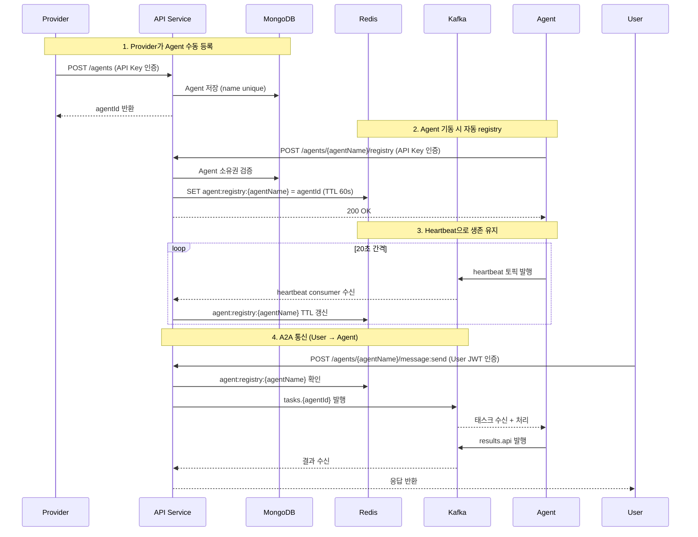

# API Service Agent Registry 재설계

## 개요

Agent 등록 흐름을 재설계한다. Provider의 수동 등록(MongoDB)은 유지하되, Agent가 기동 시 registry API를 호출하여 Redis에 생존 상태를 등록하고, heartbeat로 TTL을 갱신한다. A2A 통신은 `/api/core/agents/{agentName}/message:send`를 통해 Kafka로 중계한다.

## 변경 요약

| 항목 | 현재 | 변경 후 |
|------|------|---------|
| Agent name unique | provider 내 unique | **글로벌 unique** |
| AgentCard | capabilities, skills 등 큰 스키마 | name, description, version만 |
| Agent 생존 관리 | 없음 | Redis registry + heartbeat TTL |
| A2A 통신 | 없음 | HTTP → Kafka 프록시 |

## 전체 흐름



## Agent name 글로벌 unique

현재 `{providerId, name}` compound unique index를 **`name` 단독 unique index**로 변경한다. name이 A2A 라우팅 키 역할을 하므로 전체에서 유일해야 한다.

MongoDB 인덱스 변경:
- 제거: `{providerId: 1, name: 1}` compound unique
- 추가: `{name: 1}` unique

## AgentCard 최소화

```kotlin
data class AgentCard(
    val name: String,
    val description: String,
    val version: String,
)
```

기존 필드(capabilities, skills, iconUrl, defaultInputModes, defaultOutputModes) 모두 제거.

## Agent Registry (Redis)

### 데이터 구조

```
Key:   agent:registry:{agentName}
Value: agentId
TTL:   60초
```

### Registry API

```
POST /api/core/agents/{agentName}/registry
Header: Authorization: Bearer {api_key}
Response: 200 OK
```

검증:
1. API Key 유효? (`X-Provider-Id` 추출)
2. Agent name이 MongoDB에 존재? 
3. 해당 Agent가 요청 Provider 소유?
4. 통과 → Redis에 등록

에러:
- 인증 실패 → 401
- Agent 없음 → 404
- 소유권 불일치 → 403
- 이미 registry 됨 → 200 (멱등, TTL 갱신)

### Heartbeat Consumer

API Service가 Kafka `heartbeat` 토픽을 구독한다.

```json
{
  "agent_id": "agent-001",
  "timestamp": "2026-04-09T10:00:00Z"
}
```

처리:
1. `agent_id`로 MongoDB에서 Agent 조회 → `agentName` 획득
2. Redis `agent:registry:{agentName}` 존재 확인
3. 존재하면 TTL 60초로 갱신
4. 존재하지 않으면 무시 (registry 안 된 Agent)

### Unregistry

별도 API 없음. Agent가 종료되면 heartbeat가 멈추고 60초 후 Redis TTL 만료로 자동 해제.

## A2A 프록시 엔드포인트

```
POST /api/core/agents/{agentName}/message:send
Content-Type: application/json
```

요청 (A2A 표준):
```json
{
  "message": {
    "message_id": "msg-001",
    "role": "user",
    "parts": [{"text": "안녕하세요"}]
  },
  "context_id": "ctx-abc"
}
```

처리:
1. Redis에서 `agent:registry:{agentName}` 확인 → 없으면 `AgentUnavailableError` (-32062)
2. agentId 획득
3. Kafka `tasks.{agentId}` 토픽에 TaskMessage 발행
4. Kafka `results.api` 토픽에서 해당 `task_id`의 결과 대기 (timeout 30초)
5. 결과를 A2A 응답 포맷으로 반환

응답:
```json
{
  "task_id": "task-123",
  "context_id": "ctx-abc",
  "status": {
    "state": "completed",
    "message": {
      "message_id": "msg-002",
      "role": "agent",
      "parts": [{"text": "응답입니다"}]
    }
  },
  "final": true
}
```

타임아웃 시 `AgentTimeoutError` (-32063) 반환.

## 의존성 추가

API Service `build.gradle.kts`에 추가:
- `spring-boot-starter-data-redis` — Redis 연동
- `spring-kafka` — Kafka producer/consumer

## 프로젝트 구조 변경

```
apps/api/src/main/kotlin/com/bara/api/
├── domain/model/
│   ├── Agent.kt                    # name unique로 변경
│   └── AgentCard.kt                # 최소화 (name, description, version)
├── application/port/
│   ├── in/command/
│   │   └── RegistryAgentUseCase.kt # 새로 추가
│   ├── in/query/
│   │   └── SendMessageQuery.kt     # 새로 추가
│   └── out/
│       ├── AgentRepository.kt      # findByName 추가
│       ├── AgentRegistryPort.kt    # Redis registry 포트 (새로 추가)
│       └── TaskPublisherPort.kt    # Kafka producer 포트 (새로 추가)
├── application/service/
│   ├── command/
│   │   └── RegistryAgentService.kt # 새로 추가
│   └── query/
│       └── SendMessageService.kt   # 새로 추가
├── adapter/
│   ├── in/rest/
│   │   ├── AgentController.kt      # registry, message:send 엔드포인트 추가
│   │   └── AgentDtos.kt            # DTO 변경
│   ├── in/kafka/
│   │   └── HeartbeatConsumer.kt    # Kafka heartbeat consumer (새로 추가)
│   └── out/
│       ├── persistence/            # 기존 유지
│       ├── redis/
│       │   └── AgentRegistryRedisAdapter.kt  # 새로 추가
│       └── kafka/
│           └── TaskKafkaPublisher.kt         # 새로 추가
```

## 테스트

- AgentCard 최소화 반영 — 기존 테스트 수정
- Agent name 글로벌 unique — 등록 시 중복 검증 테스트
- RegistryAgentService — 인증, 소유권, Redis 등록 테스트
- HeartbeatConsumer — registry 된 Agent만 TTL 갱신 테스트
- SendMessageService — Redis 확인 → Kafka 발행 → 결과 대기 테스트
- E2E — 등록 → registry → 메시지 전송 → 응답 수신

## 스코프 외

- SSE 스트리밍 (`message:stream`) — 후속 단계
- Agent 간 호출 (`results.agents`) — 후속 단계
- Kafka OAUTHBEARER 인증 — 후속 단계
