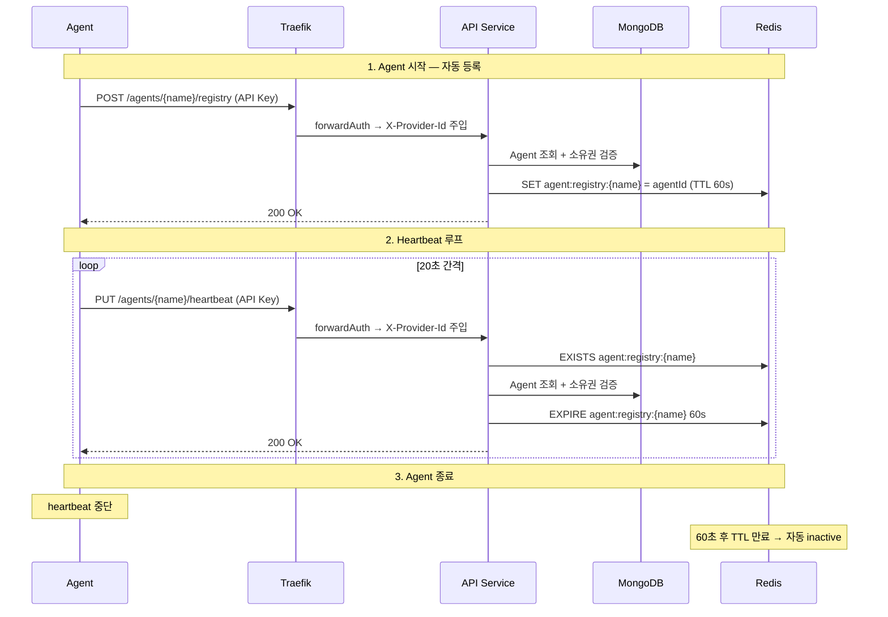

# HTTP Heartbeat Migration

## 개요

Agent의 heartbeat transport를 Kafka에서 HTTP로 전환한다. 등록(initial registry)과 주기적 heartbeat를 HTTP로 통일하여 transport 복잡도를 줄이고 Agent의 자동 등록을 구현한다.

## 변경 요약

| 항목                | 현재                         | 변경 후                             |
| ------------------- | ---------------------------- | ----------------------------------- |
| 초기 등록           | 외부에서 POST /registry 호출 | Agent 시작 시 자동 호출             |
| Heartbeat transport | Kafka `heartbeat` 토픽       | HTTP `PUT /agents/{name}/heartbeat` |
| Heartbeat 처리      | HeartbeatConsumer (Kafka)    | HeartbeatAgentService (HTTP)        |
| Agent heartbeat     | HeartbeatLoop (aiokafka)     | RegistryClient (httpx)              |
| 종료 시             | TTL 만료 대기 (60s)          | 동일 (변경 없음)                    |

## 전체 흐름



## API Service (Kotlin)

### 새 엔드포인트: PUT /agents/{agentName}/heartbeat

```
PUT /api/core/agents/{agentName}/heartbeat
Header: Authorization: Bearer {api_key}
```

처리:

1. Traefik forwardAuth가 `X-Provider-Id` 주입
2. Redis에서 `agent:registry:{agentName}` 존재 확인 → 없으면 404
3. MongoDB에서 agent 조회 → `providerId` 매칭 → 불일치 시 403
4. `agentRegistryPort.refreshTtl(agentName)` → Redis TTL 60초로 리셋
5. 200 OK

에러:

- 인증 실패 → 401
- Agent 미등록 (Redis에 없음) → 404
- 소유권 불일치 → 403

### HeartbeatAgentService

Application layer service. `heartbeat(agentName, providerId)` 메서드.

```kotlin
class HeartbeatAgentService(
    private val agentRepository: AgentRepository,
    private val agentRegistryPort: AgentRegistryPort,
) {
    fun heartbeat(agentName: String, providerId: String) {
        if (!agentRegistryPort.isRegistered(agentName)) {
            throw AgentNotRegisteredException(agentName)
        }
        val agent = agentRepository.findByName(agentName)
            ?: throw AgentNotFoundException(agentName)
        if (agent.providerId != providerId) {
            throw AgentForbiddenException(agentName, providerId)
        }
        agentRegistryPort.refreshTtl(agentName)
    }
}
```

### 프로젝트 구조 변경

```
apps/api/src/main/kotlin/com/bara/api/
├── application/service/command/
│   ├── RegistryAgentService.kt        # 기존 유지
│   └── HeartbeatAgentService.kt       # 신규
├── adapter/in/rest/
│   └── AgentController.kt             # PUT heartbeat 엔드포인트 추가
├── adapter/in/kafka/
│   └── HeartbeatConsumer.kt           # 삭제
```

### 제거

- `HeartbeatConsumer.kt` + 테스트
- Kafka `heartbeat` 토픽 관련 설정

### 유지

- `AgentRegistryPort` 인터페이스 (refreshTtl 그대로)
- `AgentRegistryRedisAdapter` (구현체 그대로)
- `RegistryAgentService` + `POST /registry` (초기 등록용 그대로)

## Agent (Python)

### RegistryClient (신규)

`agents/default/app/registry.py`:

```python
class RegistryClient:
    def __init__(self, settings: Settings):
        self._agent_name = settings.agent_name
        self._api_url = settings.api_service_url
        self._api_key = settings.provider_api_key
        self._interval = settings.heartbeat_interval
        self._client = httpx.AsyncClient(
            base_url=self._api_url,
            headers={"Authorization": f"Bearer {self._api_key}"},
        )

    async def register(self) -> None:
        response = await self._client.post(f"/agents/{self._agent_name}/registry")
        if response.status_code != 200:
            raise RegistryError(...)

    async def heartbeat_loop(self) -> None:
        while True:
            try:
                response = await self._client.put(f"/agents/{self._agent_name}/heartbeat")
                if response.status_code != 200:
                    logger.warning("heartbeat failed: %d", response.status_code)
            except httpx.HTTPError as e:
                logger.warning("heartbeat error: %s", e)
            await asyncio.sleep(self._interval)

    async def close(self) -> None:
        await self._client.aclose()
```

에러 처리 전략:

- **등록 실패** (401/403/404): 치명적 에러 → 로깅 + 종료
- **Heartbeat 실패**: 경고 로깅 + 다음 주기에 재시도
- **연속 heartbeat 실패**: 경고 누적, 서비스는 계속 유지

### Settings 확장

`agents/default/app/config.py`에 추가:

| 필드                 | 타입  | 기본값 | 설명                 |
| -------------------- | ----- | ------ | -------------------- |
| `agent_name`         | `str` | 필수   | Agent 식별자         |
| `api_service_url`    | `str` | 필수   | API Service base URL |
| `provider_api_key`   | `str` | 필수   | Provider API Key     |
| `heartbeat_interval` | `int` | `20`   | Heartbeat 주기 (초)  |

### main.py 변경

lifespan에서 HeartbeatLoop → RegistryClient로 교체:

```python
async def lifespan(app: FastAPI):
    settings = Settings()
    registry = RegistryClient(settings)
    await registry.register()          # 1. 등록 (실패 시 종료)
    producer = ResultProducer(settings)
    consumer = TaskConsumer(settings)
    await producer.start()
    await consumer.start()
    async with asyncio.TaskGroup() as tg:
        tg.create_task(registry.heartbeat_loop())  # 2. heartbeat
        tg.create_task(consumer.consume())
    # 종료 시: TTL 만료 대기, 별도 처리 없음
```

### 제거

- `agents/default/app/kafka/heartbeat.py` (HeartbeatLoop)
- `agents/default/app/models/messages.py`에서 HeartbeatMessage
- `agents/default/app/kafka/producer.py`에서 send_heartbeat

### 의존성 추가

- `httpx` (pyproject.toml)

## 인프라

### Traefik 라우트

`infra/k8s/base/gateway/routes.yaml`에 추가. 기존 registry 라우트와 동일 패턴:

```yaml
# PUT /api/core/agents/{name}/heartbeat → api-service
```

forwardAuth 미들웨어 적용 (registry 라우트와 동일).

### Kafka

`heartbeat` 토픽 제거. Kafka 자체는 유지 (task/result 통신용).

## 설정

### .env.example (agents/default)

```env
AGENT_NAME=default
API_SERVICE_URL=http://localhost/api/core
PROVIDER_API_KEY=your-api-key
HEARTBEAT_INTERVAL=20
```

## 문서 업데이트

- `docs/spec/api/agent-registry.md` — heartbeat 섹션 Kafka → HTTP로 수정
- `CLAUDE.md` — HeartbeatConsumer 관련 설명 제거, heartbeat transport HTTP로 업데이트

## 테스트

### API Service

- `HeartbeatAgentServiceTest` — 정상 TTL 갱신, 미등록 에러, 소유권 불일치 에러
- `AgentControllerTest` — PUT /heartbeat 슬라이스 테스트 (200, 403, 404)
- 기존 `HeartbeatConsumerTest` 삭제

### Agent

- `test_registry.py` — RegistryClient 단위 테스트
  - 등록 성공/실패
  - heartbeat 성공/실패 (재시도 동작)
  - httpx mock 사용
- 기존 `test_heartbeat.py` 삭제 (HeartbeatLoop)

## 스코프 외

- Graceful shutdown 시 Redis 키 즉시 삭제 — 향후 고려
- heartbeat 연속 실패 시 Agent 자가 종료 — 향후 고려
- heartbeat 호출 최적화 (MongoDB 조회 생략) — 필요 시 별도 ADR
